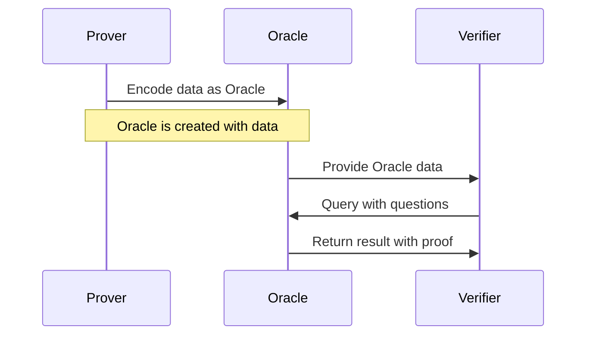

---
defaultTemplate:
  - "[[cs496-2023-fall]]"
---
### KAIST CS496(2023 fall)  ZKP - Theory and Applications
Wanseob Lim 
PSE, EF

---

#### Lecture 3
#### Polynomial Oracles

---

::: title
Recall
:::

1. Pairing 
2. KZG Commtitment
3. Fiat-Shamir Heuristics
4. Schwartz-Zippel Lemma
4. Random Oracle Model

note:
- $e(g_1^{a}, g_2^{b}) = g_T^{ab}$
- Completeness
- Soundness

---

::: title
Question
:::

+ We've shared QR codes which includes the shared secret information
+ Imagine the most of the QR codes are fake
+ What can we do there? 

---

::: title
Variants of KZG Commitments
:::
1. Batch Opening
2. Vector Commitment

---

::: title
batch opening
:::

::: left

$f(X)$ is an $N$-degree of polynomial 
if $f(X)$ interpolates the given set of points $\{(x_{i,}y_{i})\}_{i\in[n]}$ 

We're going to divide the polynomial with the accumulator polynomial which vanishes on $\{x_{i}\}_{i\in[n]}$
::: <!-- element style="font-size:0.7em" -->

--

::: left

Define the simplest accumulator polynomial as 
$A(X) = \underset{i\in[n]}{\Pi}(X - x_{i})$
And express the polynomial $f(X)$ as:
 
 
$f(X) = A(X) Q(X) + R(X)$

***

$A(X)$: accumulator polynomial 
$Q(X)$: quotient polynomial 
$R(X)$: remainder polynomial
::: <!-- element style="font-size:0.7em" -->

--

::: left
As $A(X)$ vanishes on the set $\{x_{i}\}_{i\in[n]}$, the remainder polynomial should satisfy $R(x_{i}) = y_{i}$ for all $i\in[n]$

***

If then we can define $R(X)$ as a  
**Lagrange form of Interpolation Polynomial**

$R(X) = \sum_{i=1}^{n} y_i L_i(X)$ 

where each $L_i(X)$ is the $i^{th}$ Lagrange basis polynomial, defined as:
 

$L_i(X) = \prod_{{j=1, j\neq i}}^{n} \frac{(X - x_j)}{(x_i - x_j)}$
::: <!-- element style="font-size:0.7em" -->
--

::: left

Finally, the quotient polynomial becomes 

$Q(X) = {f(X) - R(X) \over A(X)}$

To prove the batch opening of the KZG commitment, the prover computes
$g^{Q(\tau)}$ as its batch opening and the verifier verifies that checking the pairings

$e([Q(\tau)]_{1}, [A(\tau)]_{2}) \stackrel{?}{=} e([f(\tau) - R(\tau)]_{1}, [1]_{2})$

::: <!-- element style="font-size:0.7em" -->

note:
$\tau$ is the hidden random value constructed by the trusted setup process.

---

::: title
Vector Commitment
:::

- using the $n$-th **root of unity** $\omega$
- $\omega^{n} = 1$
- Fast Fourier Transform to find $\omega$
- Easy way to hide the information but being able to open some values selectively

$\vec{f} = (v_{0}, v_{1}, \dots, v_{n})$
$\iff \forall i\in[n],  f(\omega^{i}) = v_{i}$

--

::: title
Vector Commitment & the root of unity
:::

::: left

$$f(X) = \sum_{i=1}^{n} y_i L_i(X) ~ = ~A(X) \sum_{i=1}^{n} y_i \frac{L_i(X)}{A(X)}$$

$$\begin{align} f(X) & = A(X) \sum_{i=1}^{n} y_{i} \frac{L_i(X)}{A(X)} \\ & = A(X) \sum_{i=1}^{n} y_{i} \left( \prod_{{j=1, j\neq i}}^{n} \frac{(X - \omega_{j})}{(\omega_{i} - \omega_{j})} \right) \left( \prod_{j=1}^n \frac{1}{X - \omega_{j}} \right) \\ & = A(X) \sum_{i = 1}^{n} y_{i} \left( \prod_{j=1, j \neq i}^{n} \ \frac{1}{\omega_{i} - \omega_{j}} \right)\frac{1}{X - \omega_{i}} \\ & = A(X) \sum_{i=1}^{n} \frac{1}{A'(\omega_{i})(X - \omega_{i})} \end{align}$$
$$
f(X) = A(X)\left( \sum_{i = 1}^n \frac{y_{i}}{A'(\omega_{i})(X - \omega_{i})} \right)
$$

::: <!-- element style="font-size: 0.7em" -->

note:
- You can assume $A(X) = (X - \omega_{i})B(X)$
- $A'(X) = B(X) + (X - \omega_{i})B'(X)$
- $A'(\omega_{i}) = B(\omega_{i})$
- Therefore, you can easily compute $B(\omega_{i}) = (n+1) \cdot \omega_{i}^{n}$
---

::: title
Oracle Access
:::

::: left
- $\mathsf{enc}(\mathsf{data}) \rightarrow \mathsf{Oracle}$
- $\mathsf{prove}(q, \mathsf{Oracle}, \mathsf{data}, r) \rightarrow \pi$
- $\mathsf{verify}(\pi, q, r, \mathsf{Oracle}) \rightarrow \{0, 1\}$
::: <!-- element style="font-size: 0.7em; position: absolute; top: 40px" -->

<!-- element style="width: 100%; position: absolute; top: 250px" -->

---

::: title
Pedersen Commitment
:::

::: left
$\text{Com}_{pc}: \mathbb{Z}_{p} \times \mathbb{Z}_{p} \rightarrow \mathbb{G}$

$\text{Com}_{pc}(x, r) := g^{x}h^{r}$

$x, r \in \mathbb{Z}_{p}$ $C, g, h \in \mathbb{G}$

:::

--

::: title
Pedersen Commitment
:::

- Commitment $C = g^{x}\cdot h^{r}$
- $g, h \in \mathbb{G}$ are generators 
- $a$ is the discrete logarithm that satisfies $g^{a} = h$
- You can hide your value $x \in \mathbb{F}_{p}$ using the blinding factor $r \in \mathbb{F}_{p}$.
+ How to open?
+ Reveal $x, r$ or use schnorr proofs for both $x$ and $r$

--

::: title
Vector Commitment using Pedersen Commitment
:::

::: left

$\text{Com}_{pvc}: \mathbb{Z}_{p}^{n} \times \mathbb{Z}_{p} \rightarrow \mathbb{G}$

$\bbox[5px, border: 2px solid blue;]{\text{Com}_{pvc}(\mathbf{x}, r) := \mathbf{g}^{\mathbf{x}}h^{r}}$

$\mathbf{x} \in \mathbb{Z}_{P}^{n} \quad r \in \mathbb{Z}_{p}$ $\mathbf{g} \in \mathbb{G}^{n} \quad C, h \in \mathbb{G}$

$\forall i,j \in [n]: i \neq j \implies  (g_{i}, g_{j}) \in \mathcal{R}_{DLP}$

***

example: 
$$\text{Com}_{pvc}(\mathbf{x}, r) = g_{1}^{x_{1}}g_{2}^{x_{2}} \cdots g_{n}^{x_{n}}h^{r}$$ 

:::

note:
- Commitment for the Pedersen Vector Commitment is a function which accepts two variable from the $n$ size of vector space and a scalar value, and it returns a group element
- Bold denotation means that it has a vector form

--

Question

1. How many data you should reveal a vector $\mathbf{x} \in \mathbb{Z}_{p}^{n}$?
2. Is it able to open some partial values?

--

::: title
Inner Product Form of Pedersen Vector Commitment
:::

::: left
$$\begin{aligned} \text{Com}_{pvc}(\mathbf{x}, r) & = g_{1}^{x_{1}}g_{2}^{x_{2}} \cdots g_{n}^{x_{n}}h^{r} \\ & = x_{1}G_{1} + x_{2}G_{2} + \cdots + x_{n}G_{n} + rH\\ & = \begin{bmatrix} x_{1} \\ x_{2} \\ \vdots \\ x_{n} \end{bmatrix} \cdot  \begin{bmatrix}  G_{1} \\ G_{2} \\ \vdots \\ G_{n} \end{bmatrix} + rH \\ & =  \mathbf{x} \cdot \mathbf{G} + rH \end{aligned}$$
::: <!-- element style="font-size: 0.9em" -->

--

Question

Can we commit 2 vectors?

--

::: title
Inner Product Argument
:::

::: left
$$\begin{aligned} \\ \text{Com}_{ipa}(\mathbf{a}, \mathbf{b}) & = g_{1}^{a_{1}}g_{2}^{a_{2}} \cdots g_{n}^{a_{n}} \cdot h_{1}^{b_{1}}h_{2}^{b_{2}} \cdots h_{n}^{b_{n}} \cdot u^{\langle \mathbf{a}, \mathbf{b} \rangle} \\ & = a_{1}G_{1} + a_{2}G_{2} + \cdots + a_{n}G_{n} \\ & + b_{1}H_{1} + b_{2}H_{2} + \cdots + b_{n}H_{n} \\ & + {\langle \mathbf{a}, \mathbf{b} \rangle} U \\ & = \begin{bmatrix} a_{1} \\ a_{2} \\ \vdots \\ a_{n} \end{bmatrix} \cdot  \begin{bmatrix}  G_{1} \\ G_{2} \\ \vdots \\ G_{n} \end{bmatrix} + \begin{bmatrix} b_{1} \\ b_{2} \\ \vdots \\ b_{n} \end{bmatrix} \cdot  \begin{bmatrix}  H_{1} \\ H_{2} \\ \vdots \\ H_{n} \end{bmatrix} + {\langle \mathbf{a}, \mathbf{b} \rangle} U \\ & =  \mathbf{a} \cdot \mathbf{G} +  \mathbf{b} \cdot \mathbf{H} + {\langle \mathbf{a}, \mathbf{b} \rangle} U  \end{aligned}$$
::: <!-- element style="font-size: 0.9em" -->

--

Question

- How many data we should share?
- Can I partially reveal some vector data?

--
::: title
Let's try to fold them
:::

$$\vec{a}, \vec{b}, \vec{c}, \vec{d} \in \mathbb{F}^{n}$$

then,

$$\langle \vec{a} ~||~  \vec{b}, \vec{c} ~||~ \vec{d}\rangle = \langle \vec{a}, \vec{c} \rangle + \langle \vec{b}, \vec{d} \rangle$$

--

::: left

$$\begin{align} & \mathbf{a} = \mathbf{a}_{L} ~||~ \mathbf{a}_{R}  \\ & \mathbf{b} = \mathbf{b}_{L} ~||~ \mathbf{b}_{R} \\ & \mathbf{G} = \mathbf{G}_{L} ~||~ \mathbf{G}_{R} \\ &  \mathbf{H} = \mathbf{H}_{L} ~||~ \mathbf{H}_{R} \end{align}$$

*** 

$$\begin{align} C & = \langle \mathbf{a}, \mathbf{G} \rangle + \langle \mathbf{b}, \mathbf{H} \rangle & + \langle \mathbf{a}, \mathbf{b} \rangle \cdot U \\ & = \langle \mathbf{a}_{L} ~||~ \mathbf{a}_{R}, \quad \mathbf{G}_{L} ~||~ \mathbf{G}_{R} \rangle + \langle \mathbf{b}_{L} ~||~ \mathbf{b}_{R}, \quad \mathbf{H}_{L} ~||~ \mathbf{H}_{R} \rangle & + \langle \mathbf{a}_{L} ~||~ \mathbf{a}_{R}, \quad \mathbf{b}_{L} ~||~ \mathbf{b}_{R} \rangle \cdot U \\ & = \langle \mathbf{a}_{L}, \mathbf{G}_{L} \rangle + \langle \mathbf{a}_{R},  \mathbf{G}_{R} \rangle + \langle \mathbf{b}_{L}, \mathbf{H}_{L} \rangle + \langle \mathbf{b}_{R}, \mathbf{H}_{R} \rangle & + (\langle \mathbf{a}_{L}, \mathbf{b}_{L} \rangle + \langle \mathbf{a}_{R}, \mathbf{b}_{R} \rangle ) \cdot U \\ \end{align}$$
::: <!-- element style="font-size: 0.6em" -->

--

::: left
$$\begin{align} & \mathbf{a'} =\mathbf{a}_{L} + x \cdot \mathbf{a}_{R} \\ & \mathbf{b'} =\mathbf{b}_{L} + x^{-1} \cdot \mathbf{b}_{R} \\ & \mathbf{G'} =\mathbf{G}_{L} + x^{-1} \cdot \mathbf{G}_{R} \\ & \mathbf{H'} =\mathbf{H}_{L} + x \cdot \mathbf{H}_{R} \end{align}$$
***
And try to compute
$$ C' = \langle \mathbf{a'}, \mathbf{G'} \rangle + \langle \mathbf{b'}, \mathbf{H'} \rangle + \langle \mathbf{a'}, \mathbf{b'} \rangle ~ U$$
:::

--

::: left
$$\begin{align} \\ \\ C' & = \langle \mathbf{a'}, \mathbf{G'} \rangle + \langle \mathbf{b'}, \mathbf{H'} \rangle + \langle \mathbf{a'}, \mathbf{b'} \rangle ~ U \\ \\ & = \langle \mathbf{a'}, \mathbf{G'} \rangle  \\ & + \langle \mathbf{b'}, \mathbf{H'} \rangle  \\ & + \langle \mathbf{a'}, \mathbf{b'} \rangle ~ U \\ \\ & = (\mathbf{a}_{L} + x ~ \mathbf{a}_{R}) \cdot (\mathbf{G}_{L} + x^{-1} ~ \mathbf{G}_{R}) \\ & + (\mathbf{b}_{L} + x^{-1} ~ \mathbf{b}_{R}) \cdot (\mathbf{H}_{L} + x ~ \mathbf{H}_{R}) \\ & + (\mathbf{a}_{L} + x ~ \mathbf{a}_{R}) \cdot (\mathbf{b}_{L} + x^{-1} ~ \mathbf{b}_{R}) ~ U \\ \\ & = \langle \mathbf{a}_{L}, \mathbf{G}_{L} \rangle + \langle \mathbf{a}_{R}, \mathbf{G}_{R} \rangle + x^{-1} ~ \langle \mathbf{a}_{L}, \mathbf{G}_{R} \rangle + x ~ \langle \mathbf{a}_{R}, \mathbf{G}_{L} \rangle \\ & + \langle \mathbf{b}_{L}, \mathbf{H}_{L} \rangle + \langle \mathbf{b}_{R}, \mathbf{H}_{R} \rangle + x^{-1} ~ \langle \mathbf{b}_{R}, \mathbf{H}_{L} \rangle + x ~ \langle \mathbf{b}_{L}, \mathbf{H}_{R} \rangle \\ & + ( \langle \mathbf{a}_{L}, \mathbf{b}_{L} \rangle + \langle \mathbf{a}_{R}, \mathbf{b}_{R} \rangle + x^{-1} ~ \langle \mathbf{a}_{L}, \mathbf{b}_{R} \rangle + x ~ \langle \mathbf{a}_{R}, \mathbf{b}_{L} \rangle ) U \\ \\ & = \underbrace{\langle \mathbf{a}_{L}, \mathbf{G}_{L} \rangle + \langle \mathbf{a}_{R}, \mathbf{G}_{R} \rangle + \langle \mathbf{b}_{L}, \mathbf{H}_{L} \rangle + \langle \mathbf{b}_{R}, \mathbf{H}_{R} \rangle + (\langle \mathbf{a}_{L}, \mathbf{b}_{L} \rangle + \langle \mathbf{a}_{R}, \mathbf{b}_{R} \rangle) U}_{C} \\ & + x^{-1} \underbrace{(~ \langle \mathbf{a}_{L}, \mathbf{G}_{R} \rangle + \langle \mathbf{b}_{R}, \mathbf{H}_{L} \rangle + \langle \mathbf{a}_{L}, \mathbf{b}_{R} \rangle U)}_{C_{R}} \\ &  + x \underbrace{( \langle \mathbf{a}_{R}, \mathbf{G}_{L} \rangle + \langle \mathbf{b}_{L}, \mathbf{H}_{R} \rangle + \langle \mathbf{a}_{R}, \mathbf{b}_{L} \rangle U)}_{C_{L}} \\ \\ \\ & = x C_{L} + C + x^{-1} C_{R} \end{align}$$
:::<!-- element style="font-size:0.55em" -->

--
::: title
IPA protocol
:::

::: left
1. $\mathcal{P} - (C, C_{L}, C_{R}) \rightarrow \mathcal{V}$: Prover claims an argument of knowledge about a vector $\mathbf{a}$ , $\mathbf{b}$. And gives its pedersen commitment $C$ which uses the inner product of $\langle \mathbf{a}, \mathbf{b} \rangle$ for its blinding factor and its left commitment $C_{L}$ and the right commitment $C_{R}$.
2) $\mathcal{V} - (x) \rightarrow \mathcal{P}$:  Verifier picks a random $x$ or $x = \text{hash}(C_{L}, C_{R})$ and asks $\mathcal{P}$ to return $\mathbf{a'}, \mathbf{b'}, \mathbf{G'}, \mathbf{H'}$ This helps hiding the vector values $\mathbf{a}, \mathbf{b}$
3) $\mathcal{P} - (\mathbf{a'}, \mathbf{b'}) \rightarrow \mathcal{V}$:  Prover computes the folded vectors and gives them to the $\mathcal{V}$
4) $\mathcal{V}$ computes the folded generators $\mathbf{G'}, \mathbf{H'}$ by
	- $\mathbf{G'} = \mathbf{G}_{L} + x^{-1} ~ \mathbf{G}_{R}$
	- $\mathbf{H'} = \mathbf{H}_{L} + x ~ \mathbf{H}_{R}$
	and accepts the claim if the given parameters $(\mathbf{a'}, \mathbf{b'}, C, C_{L}, C_{R})$ satisfy that 
	- $C' = \langle \mathbf{a'}, \mathbf{G'} \rangle + \langle \mathbf{b'}, \mathbf{H'} \rangle + \langle \mathbf{a'}, \mathbf{b'} \rangle ~ H \stackrel{?}{=} x~ C_{L} + C +x^{-1}~C_{R}$
::: <!-- element style="font-size: 0.6em" -->

--

Its next step is computing $C''$ using $(\mathbf{x''}_{L}, \mathbf{x''}_{R}, C', C'_{L}, C'_{R})$, and we'll repeat this until the left & right vectors have 1 dimension.

Repeat recursively

--

Question: Can the $\mathcal{V}$ extract $\mathbf{a}$ from $\mathbf{a'}$ ? No it's not able to do that as it's a linear combination

--

::: title
Optimization
:::

::: left
$$ \mathbf{G}_{0} =  \begin{bmatrix} G_{1} \\ G_{2} \\ \vdots \\ G_{2^{l - 1} - 1} \\ G_{2^{l - 1}} \\ G_{2^{l - 1} + 1} \\ G_{2^{l - 1} + 2} \\ \vdots \\ G_{2^{l} - 1} \\ G_{2^{l}} \\ \end{bmatrix} \quad \mathbf{G}_{1} = \mathbf{G}_{0L} + x_{1}^{-1} \mathbf{G}_{0R} = \\ \begin{bmatrix} G_{1} +  x_{1}^{-1} G_{2^{l - 1} + 1}\\ G_{2} +  x_{1}^{-1} G_{2^{l - 1} + 2}\\ \vdots \\ G_{2^{l - 2} - 1} +  x_{1}^{-1} G_{2^{l - 1} - 1}\\ G_{2^{l - 2}} +  x_{1}^{-1} G_{2^{l - 1}}\\ G_{2^{l - 2} + 1} +  x_{1}^{-1} G_{2^{l - 1} + 1}\\ G_{2^{l - 2} + 2} +  x_{1}^{-1} G_{2^{l - 1} + 2}\\ \vdots \\ G_{2^{l - 1} - 1} +  x_{1}^{-1} G_{2^{l} - 1}\\ G_{2^{l - 1}} +  x_{1}^{-1} G_{2^{l}}\\ \end{bmatrix}$$
::: <!-- element style="font-size: 0.7em" -->

--

::: title
Optimization
:::

::: left
$$ \mathbf{G}_{2} = \mathbf{G}_{1L} + x_{2}^{-1} \mathbf{G}_{1R} =  \begin{bmatrix} (G_{1} +  x_{1}^{-1} G_{2^{l - 1} + 1}) + x_{2}^{-1} (G_{2^{l - 2} + 1} + x_{1}^{-1} G_{2^{l - 1} + 1}) \\ (G_{2} +  x_{1}^{-1} G_{2^{l - 1} + 2}) + x_{2}^{-1} (G_{2^{l - 2} + 2} + x_{1}^{-1} G_{2^{l - 1} + 2}) \\ \vdots \\ (G_{2^{l - 3}} +  x_{1}^{-1} G_{2^{l - 3} + 2^{l-1}}) + x_{2}^{-1} (G_{2^{l - 2} - 1} + x_{1}^{-1} G_{2^l - 1}) \\ (G_{2^{l - 3} + 1} +  x_{1}^{-1} G_{2^{l - 3} + 1 + 2^{l-1}}) + x_{2}^{-1} (G_{2^{l - 2}} + x_{1}^{-1} G_{2^l}) \\ \end{bmatrix}$$
::: <!-- element style="font-size: 0.7em" -->

--

::: title
Optimization
:::

::: left

 

$$\mathbf{G}_{l} = \\ \begin{bmatrix} G_{l} \end{bmatrix} \\ = \begin{bmatrix} G_{1} + \cdots + x_{1}^{-1}x_{2}^{-1} \dots x_{l}^{-1}G_{2^l} \end{bmatrix}$$

So it can be expressed as a **Multi-scalar multiplication**

$$G_{l} = \langle \mathbf{x}_{g},  \mathbf{G}_{0} \rangle$$

where $\mathbf{x}_{g}$ is the coeff of 

$$f_{g}(X) = \prod_{i = 0}^{l}(1 + x_{l - i}^{-1} X^{2^{i}})$$

*** 

$$ \mathbf{H}_{l} = \\ \begin{bmatrix} H_{l} \end{bmatrix} \\ = \begin{bmatrix} H_{1} + \cdots + x_{1}x_{2} \dots x_{l}H_{2^l} \end{bmatrix} $$

$$H_{l} = \langle \mathbf{x}_{h},  \mathbf{H}_{0} \rangle$$

where $\mathbf{x}_{h}$ is the coeff of 

$$f_{h}(X) = \prod_{i = 0}^{l}(1 + x_{l - i} X^{2^{i}})$$
::: <!-- element style="font-size: 0.7em" -->

--

::: title
Optimized Protocol
:::

::: left
1. $\mathcal{P}$ sends 
		$(C, C_{1L}, C_{1R}, \dots, C_{lL}, C_{lR}, a, b)$ where $C, C_{iL}, C_{iR} \in \mathbb{G}$ and $a, b \in \mathbb{Z}_{p}$
2) $\mathcal{V}$ computes the random set for each round
	$\{x_{i\in[0,l]} ~ | ~ x_{l-i} = \text{Hash}(C_{(l-i)L}, C_{(l-i)R})\}$
3) Then compute the final generator set $G_{l}$ and $H_{l}$
4) And compute the last commitment using $a, b$ by $C_{l} = aG_{l} + bH_{l} + abQ$
5) Using the random set $x_{i}$ value compute its parent commitment as
	$C_{i-1} = C_{i} - x_{i}C_{iL} - x_{i}^{-1}C_{iR}$
6) Recursively compute and finally check that $C_{0} == C$	
::: <!-- element style="font-size: 0.7em" -->

--
::: title
Evaluation of the polynomial commitment
:::

::: left
- $f(X) = \mathbf{a} \cdot \mathbf{X}$
+ $F = \mathbf{a} \cdot \mathbf{G}$
+ $\mathbf{b} = \mathbf{x} = \begin{bmatrix}1 ~ x^{1} ~ x^{2} ~ \cdots ~ x^{n}\end{bmatrix}^{T}$
+ $y = f(x)$ where  $y = \mathbf{a}\cdot \mathbf{b}$
:::

--
::: title
Batch opening
:::

::: left
$$
f(X) = A(X)\left( \sum_{i = 1}^n \frac{y_{i}}{A'(\omega_{i})(X - \omega_{i})} \right)
$$

$$\mathbf{b}(X) = \begin{bmatrix}\frac{A(X)}{A'(x_{1}) (X - x_{1})} \\\frac{A(X)}{A'(x_{2}) (X - x_{2})} \\\frac{A(X)}{A'(x_{3}) (X - x_{3})} \\\vdots \\\frac{A(X)}{A'(x_{n}) (X - x_{n})} \\\end{bmatrix}$$

We can evaluate $f(X) = \langle [y_{1}, y_{2}, \dots, y_{n}]^T, \mathbf{b}(X) \rangle$ at a random $r$ and giving $\mathbf{b}(X)$ and $[y_{1}, y_{2}, \dots, y_{n}]$ allows you to do the batch opening for those points.

::: <!-- element style="font-size: 0.6em" -->

---

::: title
Comparison
:::

KZG vs Pedersen + IPA