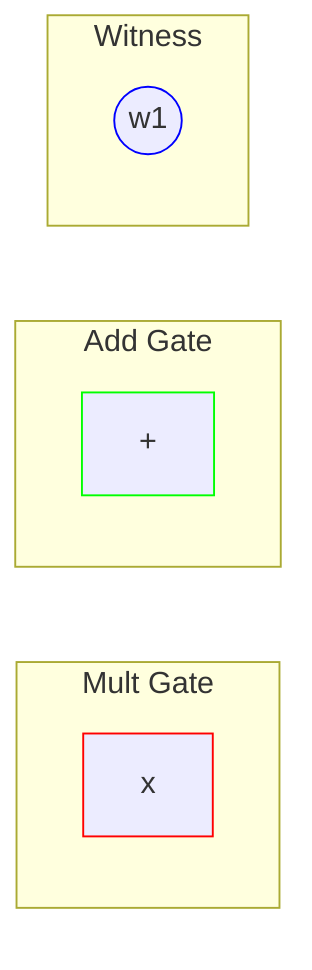
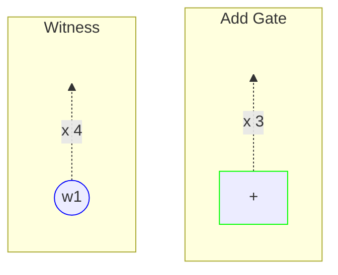
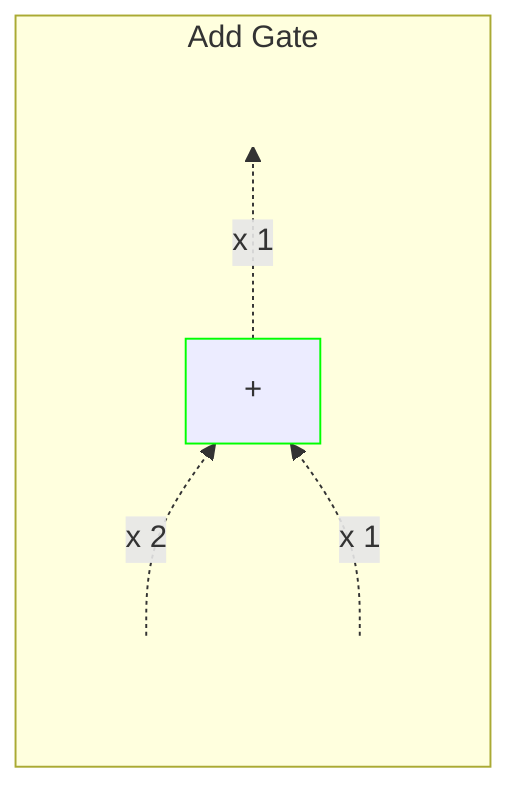
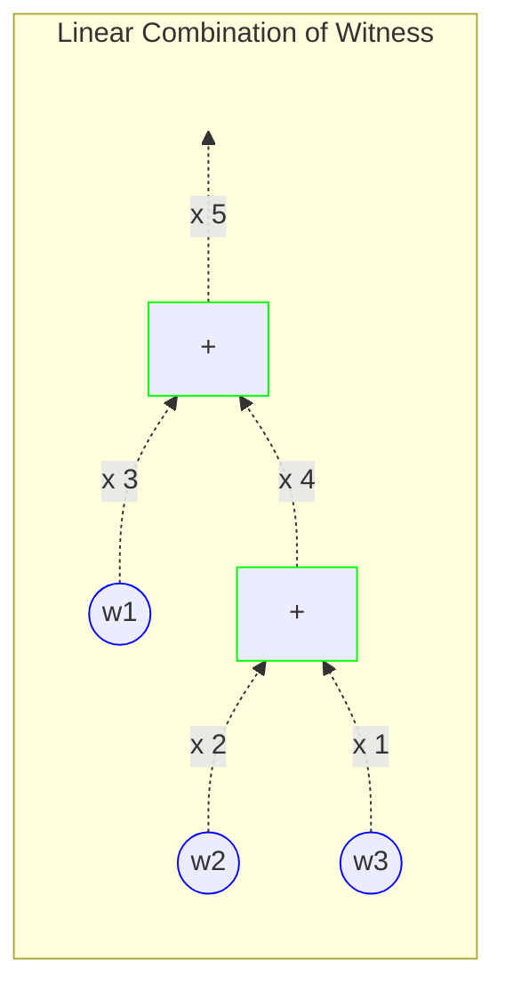
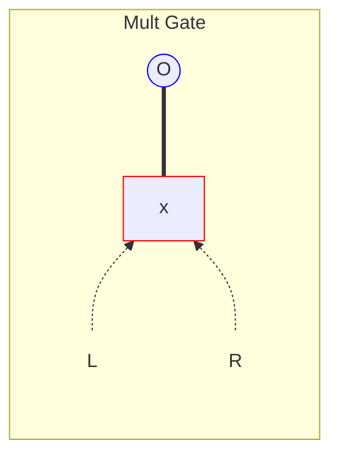
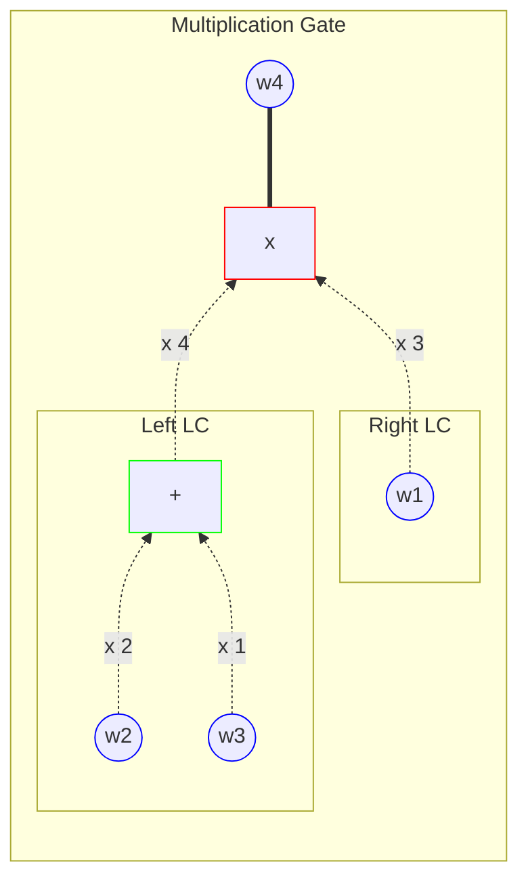
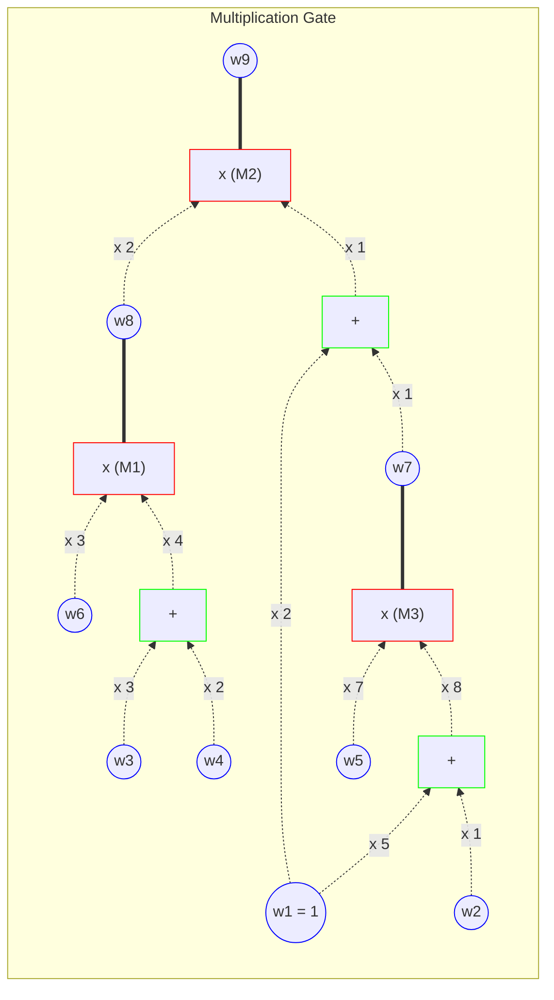

---
defaultTemplate:
  - "[[cs496-2023-fall]]"
---
### KAIST CS496(2023 fall)  ZKP - Theory and Applications
Wanseob Lim 
PSE, EF

---

#### Lecture 4
#### Programmable zk-SNARK
R1CS, QAP, Groth16

---

::: title
Recall
:::

1. Polynomial Commitment & Interactive Oracle Proof
2. KZG Commtitment
3. Inner Product Argument

--

::: title
PCS & Poly-IOP
:::

::: left
$f(X) = A(X) Q(X) + R(X)$

How to prove that $f(x_{1}) = y_{1}$ and $f(x_{2})=y_{2}$?
+ Set
	+ $A(X) = (X - x_{1})(X - x_{2})$ 
	+ $R(X) = \sum_{i\in[2]} y_{i}L_{i}(X)$
+ There should exist $Q(X)$
+ Also, they should satisfy $f(r) = A(r)Q(r) + R(r)$ at a random $r$ (public coin)
+ Its soundness is $\le \frac{d}{\mid \mathbb{F} \mid}$ (Schwartz-Zippel)
::: <!-- element style="font-size: 0.7em" -->

--

::: title
Adding more contraints
:::

::: left
1) Three polynomials
	- $L(X)$: Left side polynomial
	- $R(X)$: Right side polynomial
	- $O(X)$: Output polynomial
1) Two subsets:
	-  $\mathbb{H} = \{\omega^{0}, \omega^{1}, \dots, \omega^{N-1}\} \subset \mathbb{F}$
	-  $\mathbb{W} = \{1, w_{1}, w_{2}, \dots, w_{n}\} \subset \mathbb{F}$
1) $\forall X \in \mathbb{H}$
	+ $L(X)R(X) = O(X)$
	+ $L(X), R(X), O(X)$ is a linear combination of witnesses
::: <!-- element style="font-size: 0.8em" -->

---

::: title
Nodes
:::
::: left-6
1. Witness Node 
2. Addition Gate Node
3. Multiplication Gate Node
:::
::: right-3

:::

--

::: title
Input Wire
:::
::: left-6
1. We can create an input wire from a **witness** or **addition gate** node
2. Input wire has a **scalar** value
::: <!-- element style="font-size:0.7em" -->
::: right-3

:::

--

::: title
Addition Gate
:::
::: left-6
1. Addition Gate has **2 input wires**
2. Always outputs an input wire
::: <!-- element style="font-size:0.7em" -->
::: right-3

:::

--

::: title
Linear Combination With Addition Gate
:::

::: left-6
We can express a **linear combination** of witness values using witness & addition gates nodes and input wires

Therefore, an input wire can be considered as feeding a linear combination of witness values to another gate.
::: <!-- element style="font-size:0.68em" -->

::: right-3

:::

--

::: title
Multiplication Gate
:::
::: left-6
1. Multiplication Gate has **2 input wires**
2. Outputs an witness node
2. Creates a **constraint**(solid line) with its output such that $L \cdot R = O$

::: <!-- element style="font-size:0.7em" -->
::: right-3

:::

--

::: title
R1CS
:::

::: left-6
A mult gate creates a constraints between two linear combinations of witness values, where each linear combination's at most degree is 1
::: <!-- element style="font-size:0.7em" -->

::: right-3

:::

--

::: title
QAP w/ R1CS
:::

::: left-6
1. We have $N=3$ **multiplicative gates** 
2. Set a **subset $\mathbb{H}_{M}$** to express a circuit with $N$ multiplicative gates $\mathbb{H}_{M} = \{h_{1}, h_{2}, \dots, h_{N}\} \subset \mathbb{F}_{p}$ 
		(Mostly, we use powers of $N$-th root of unity for $\mathbb{H}_{M}$)<!-- element style="font-size: 0.7em"--> 
1. Create **algebraic constraints**  
		$\forall X \in \mathbb{H}_{M}$ 
		$L_{\mathbf{w}}(X) \cdot R_{\mathbf{w}}(X) = O_{\mathbf{w}}(X)$ 
4. **Centrifugate the witness $\mathbf{w}$ from** the polynomial $L_{\mathbf{w}}(X), R_{\mathbf{w}}(X), O_{\mathbf{w}}(X)$ 
		
::: <!-- element style="font-size:0.7em" -->
::: right-3

:::

--

::: title
QAP w/ R1CS
:::

::: left-5
 
 

Witness Vector: $\mathbf{w} = [w_{1}, w_{2}, w_{3}, \dots, w_{9}]^{T}$ (* $w_{1} = 1$)

***

$$\begin{align}L_{\mathbf{w}}(h_{1}) &  = 0 \cdot w_{1} + \cdots + 3 \cdot w_{6} + \cdots + 0 \cdot w_{9} & \\&  = \underbrace{[0 ~ 0 ~ 0 ~ 0 ~ 0 ~ 3 ~ 0 ~ 0 ~ 0]}_{\mathbf{L}_{h_{1}}^{T}} \cdot \mathbf{w} \\ & = \langle \mathbf{L}_{h_{1}}, \mathbf{w} \rangle\end{align}$$

***

$$\begin{align}L_{\mathbf{w}}(h_{2}) &  = 0 \cdot w_{1} + \cdots + 2 \cdot w_{8} + 0 \cdot w_{9} & \\&  = \underbrace{[0 ~ 0 ~ 0 ~ 0 ~ 0 ~ 0 ~ 0 ~ 2 ~ 0]}_{\mathbf{L}_{h_{2}}^{T}} \cdot \mathbf{w} \\ & = \langle \mathbf{L}_{h_{2}}, \mathbf{w} \rangle\end{align}$$

***
$$\begin{align}L_{\mathbf{w}}(h_{3}) &  = 40 \cdot w_{1} + 8 \cdot w_{2} + \cdots + 0 \cdot w_{9} & \\&  = \underbrace{[40 ~ 8 ~ 0 ~ 0 ~ 0 ~ 0 ~ 0 ~ 0 ~ 0]}_{\mathbf{L}_{h_{3}}^{T}} \cdot \mathbf{w} \\ & = \langle \mathbf{L}_{h_{3}}, \mathbf{w} \rangle\end{align}$$

::: <!-- element style="font-size:0.5em" -->

::: right-3

:::

--

::: title
QAP w/ R1CS
:::

::: left-5
 
 

Witness Vector: $\mathbf{w} = [w_{1}, w_{2}, w_{3}, \dots, w_{9}]^{T}$ (* $w_{1} = 1$)

***

$$\begin{align}L_{\mathbf{w}}(h_{1}) &  = 0 \cdot w_{1} + \cdots + 3 \cdot w_{6} + \cdots + 0 \cdot w_{9} & \\&  = \underbrace{[0 ~ 0 ~ 0 ~ 0 ~ 0 ~ 3 ~ 0 ~ 0 ~ 0]}_{\mathbf{L}_{h_{1}}^{T}} \cdot \mathbf{w} \\ & = \langle \mathbf{L}_{h_{1}}, \mathbf{w} \rangle\end{align}$$

***

$$\begin{align}L_{\mathbf{w}}(h_{2}) &  = 0 \cdot w_{1} + \cdots + 2 \cdot w_{8} + 0 \cdot w_{9} & \\&  = \underbrace{[0 ~ 0 ~ 0 ~ 0 ~ 0 ~ 0 ~ 0 ~ 2 ~ 0]}_{\mathbf{L}_{h_{2}}^{T}} \cdot \mathbf{w} \\ & = \langle \mathbf{L}_{h_{2}}, \mathbf{w} \rangle\end{align}$$

***
$$\begin{align}L_{\mathbf{w}}(h_{3}) &  = 40 \cdot w_{1} + 8 \cdot w_{2} + \cdots + 0 \cdot w_{9} & \\&  = \underbrace{[40 ~ 8 ~ 0 ~ 0 ~ 0 ~ 0 ~ 0 ~ 0 ~ 0]}_{\mathbf{L}_{h_{3}}^{T}} \cdot \mathbf{w} \\ & = \langle \mathbf{L}_{h_{3}}, \mathbf{w} \rangle\end{align}$$

::: <!-- element style="font-size:0.4em" -->

::: right-5

Finally, generalize the left polynomial for an $N$ mult gates as 

$L_{\mathbf{w}}(X) = \underset{x\in \mathbb{H}_{M}}{\sum} \langle \mathbf{L}_{x}, \mathbf{w} \rangle \cdot l_{x}(X) = \langle (\underset{x\in \mathbb{H}_{M}}{\sum}\mathbf{L}_{x} \cdot l_{x}(X)), \mathbf{w} \rangle = \langle \mathbf{L}(X), \mathbf{w} \rangle$ 

where $l_{x}(X)$ is its Lagrange basis polynomial such that $l_{x}(X)=\underset{\begin{align} \forall & x' \in \mathbb{H}_{M} \\ & x' \neq x\end{align}}{\prod} \frac{X-x'}{x-x'} =   \begin{cases} 1  & \text{if } X = x \\ 0  & \text{if } X \in \mathbb{H}_{M} \text{ and } X \neq x \end{cases}$

And $\mathbf{L}(X)$ can be expressed as a vector polynomial size of $N$ which is a circuit data independent to the witness $\mathbf{w}$.

$L_{\mathbf{w}}(X) = \underbrace{\begin{bmatrix} L_{1}(X) \\ L_{2}(X) \\ \vdots \\ L_{N}(X) \end{bmatrix}}_{\mathbf{L}(X)} \cdot \underbrace{\begin{bmatrix} w_{1}\\ w_{2} \\ \vdots \\ w_{N} \end{bmatrix}}_{\mathbf{w}} = \langle \mathbf{L}(X), \mathbf{w} \rangle$

::: <!-- element style="font-size:0.4em" -->

--

::: title
QAP w/ R1CS
:::

::: left-7

Create matrices for left, right, and output polynomials

- $L_{\mathbf{w}}(X) =  \langle \mathbf{L}(X), \mathbf{w} \rangle$
- $R_{\mathbf{w}}(X) = \langle \mathbf{R}(X), \mathbf{w} \rangle$
- $O_{\mathbf{w}}(X) = \langle \mathbf{O}(X), \mathbf{w} \rangle$

***

Constraints turns into an algebraic formula:

$\begin{align} & \forall X \in \mathbb{H}_{M}, \\ & p_{\mathbf{w}}(X) = L_{\mathbf{w}}(X) \cdot R_{\mathbf{w}}(X) - O_{\mathbf{w}}(X) = 0\end{align}$
***

$\iff \exists Q_{\mathbf{w}}(X) \quad s.t. \quad p_{\mathbf{w}}(X) = A_{\mathbf{}}(X)Q_{\mathbf{w}}(X)$
- where $A(X)=\underset{\forall x \in \mathbb{H}_{M}}{\prod}(X-x)$ 
- Then the verifier checks at a random point such that $p_{\mathbf{w}}(r) = A(r)Q_{\mathbf{w}}(r) = L_{\mathbf{w}}(r) \cdot R_{\mathbf{w}}(r)-O_{\mathbf{w}}(r)$
::: <!-- element style="font-size:0.60em" -->

::: right-3

:::

note: 
- The problem is that computing the quotient polynomial takes long time
- Use Hadamard Product Approach
- Or Sumcheck Approach
- If we use $N$-th root of unity, $A(X) = X^{N} -1$

---

::: title
Groth16
:::

::: left-3
R1CS:

$L_{\mathbf{w}}(X) = \langle \mathbf{L}(X), \mathbf{w} \rangle$
$R_{\mathbf{w}}(X) = \langle \mathbf{R}(X), \mathbf{w} \rangle$
$O_{\mathbf{w}}(X) = \langle \mathbf{O}(X), \mathbf{w} \rangle$
$\begin{align} & p_{\mathbf{w}}(X) = L_{\mathbf{w}}(X)\cdot R_{\mathbf{w}}(X) - O_{\mathbf{w}}(X)\end{align}$

***
QAP:

$\begin{align} \forall X \in \mathbb{H} \quad & p_{\mathbf{w}}(X) = 0 \\ \iff \exists & Q_{\mathbf{w}}(X) \\ s.t. \quad  & p_{\mathbf{w}}(X) = A(X)Q_{\mathbf{w}}(X) \\ & A(X)=\underset{x \in \mathbb{H}_{M}}{\prod}(X-x)\end{align}$
::: <!-- element style="font-size:0.6em" -->

::: right-5
- $\mathbf{L}(X), \mathbf{R}(X), \mathbf{O}(X)$ are public
- $\mathbf{w}$ is private
+ What if the prover shares $L_{\mathbf{w}}(r), R_{\mathbf{w}}(r), O_{\mathbf{w}}(r)$?
	+ I can infer some values
+ What if we use $\tau$ which is computed by the trusted setup?
	+ I still can try some brute force attack to test it
+ What should we do?
	+ Random Linear Combination
::: <!-- element style="font-size:0.6em" -->

--

::: title
Groth16
:::

::: left-3

R1CS:

$L_{\mathbf{w}}(X) = \langle \mathbf{L}(X), \mathbf{w} \rangle$
$R_{\mathbf{w}}(X) = \langle \mathbf{R}(X), \mathbf{w} \rangle$
$O_{\mathbf{w}}(X) = \langle \mathbf{O}(X), \mathbf{w} \rangle$
$\begin{align} & p_{\mathbf{w}}(X) = L_{\mathbf{w}}(X)\cdot R_{\mathbf{w}}(X) - O_{\mathbf{w}}(X)\end{align}$

***
QAP:

$\begin{align} \forall X \in \mathbb{H} \quad & p_{\mathbf{w}}(X) = 0 \\ \iff \exists & Q_{\mathbf{w}}(X) \\ s.t. \quad  & p_{\mathbf{w}}(X) = A(X)Q_{\mathbf{w}}(X) \\ & A(X)=\underset{x \in \mathbb{H}_{M}}{\prod}(X-x)\end{align}$
::: <!-- element style="font-size:0.6em" -->

::: right-5
$p_{\mathbf{w}}(r) = L_{\mathbf{w}}(r)R_{\mathbf{w}}(r) - O_{\mathbf{w}}(r)$

$p_{1} = \alpha + L_{\mathbf{w}}(r)$<!-- element class="fragment" data-fragment-index="2"--> 
$p_{2} = \beta + R_{\mathbf{w}}(r)$<!-- element class="fragment" data-fragment-index="3"--> 
$p_{3} = \alpha R_{\mathbf{w}}(r) + \beta L_{\mathbf{w}}(r) + O_{\mathbf{w}}(r) + A(r)Q_{\mathbf{w}}(r)$<!-- element class="fragment" data-fragment-index="4"--> 
$p_{1}\cdot p_{2} - p_{3}= \alpha \cdot \beta$<!-- element class="fragment" data-fragment-index="5"--> 
+ What if $\mathcal{P}$ shares $g^{p_{1}}, g^{p_{2}}, g^{p_{3}}$ instead? <!-- element class="fragment" data-fragment-index="6"-->
+ $\mathcal{P}$ can hide $L_{\mathbf{w}}(r), R_{\mathbf{w}}(r), O_{\mathbf{w}}(r)$ which can leak $\mathbf{W}$<!-- element class="fragment" data-fragment-index="7"-->
+ $\begin{align}& p_{1}\cdot p_{2} - p_{3}= \alpha \cdot \beta \\ & \iff e(g^{p_{1}}, g^{p_{2}}) = e(g^{p_{3}}, g)e(g^{\alpha}, g^{\beta})\end{align}$<!-- element class="fragment" data-fragment-index="8"-->
+ Let's use Fiat-Shamir to make it all non-interactive<!-- element class="fragment" data-fragment-index="9"-->
::: <!-- element style="font-size:0.6em" -->

--

::: title
Groth16 + Fiat-Shamir
:::

::: left

$p_{\mathbf{w}}(\tau) = L_{\mathbf{w}}(\tau)\cdot R_{\mathbf{w}}(\tau) - O_{\mathbf{w}}(\tau)$ 
$p_{1} = \alpha + L_{\mathbf{w}}(\tau)$  **$\pi_{1} = g^{\alpha + L_{\mathbf{w}}(\tau)}$** 
$p_{2} = \beta + R_{\mathbf{w}}(\tau)$ **$\pi_{2} = g^{\beta + R_{\mathbf{w}}(\tau)}$** 
$p_{3} = \alpha R_{\mathbf{w}}(\tau) + \beta L_{\mathbf{w}}(\tau) + O_{\mathbf{w}}(\tau) + A(\tau)Q_{\mathbf{w}}(\tau)$**$\pi_{3} = g^{\alpha R(\tau) + \beta L(\tau) + O(\tau) + A(\tau)Q(\tau)}$** 
$p_{1}\cdot p_{2} - p_{3}= \alpha \cdot \beta$    **$e(\pi_{1}, \pi_{2}) \stackrel{?}{=} e(\pi_{3}, g) \cdot e(g^{\alpha}, g^{\beta})$**

- $g^{L_{\mathbf{w}}(\tau)} = g^{\langle \mathbf{L}(\tau), \mathbf{w} \rangle}$
- $g^{R_{\mathbf{w}}(\tau)} = g^{\langle \mathbf{R}(\tau), \mathbf{w} \rangle}$
- $g^{O_{\mathbf{w}}(\tau)} = g^{\langle \mathbf{O}(\tau), \mathbf{w} \rangle}$
- $g^{A(\tau)} = g^{\prod_{\forall x \in \mathbb{H}_{M}}(\tau - x)}$
- $g^{Q(\tau)} = g^{\sum_{x\in \mathbb{H}_{Q}} q_{x}l_{qx}(\tau)}$
- $g^{\beta L_{\mathbf{w}}(\tau)} = g^{\langle \beta\mathbf{L}(\tau), \mathbf{w} \rangle}$ 
- $g^{\alpha R_{\mathbf{w}}(\tau)} = g^{\langle \alpha\mathbf{R}(\tau), \mathbf{w} \rangle}$ 
::: <!-- element style="font-size:0.5em" -->

--

::: title
Groth16 + Fiat-Shamir
:::

::: left-3
 
 

<u>Circuit Information</u>:

- **$\mathbf{L}(\tau)$**
- **$\mathbf{R}(\tau)$**
- **$\mathbf{O}(\tau)$**
- **$\beta \mathbf{L}(\tau)$**
- **$\alpha \mathbf{R}(\tau)$**

<u>Private Input(Witness)</u>:

$\mathbf{w} = \begin{bmatrix} w_{1} = 1\\ w_{2} \\ \vdots \\ w_{n} \end{bmatrix}$

<u>Verification Keys</u>:
- $g^{\alpha}, g^{\beta}$
::: <!-- element style="font-size:0.45em" -->

::: right-7
 
 
 

<u>Fiat-Shamir Transformed L,R,O polynomials</u>:
- $L_{\mathbf{w}}(\tau) = \langle $**$\mathbf{L}(\tau)$**$, \mathbf{w} \rangle$
- $R_{\mathbf{w}}(\tau) = \langle $**$\mathbf{R}(\tau)$**$, \mathbf{w} \rangle$
- $O_{\mathbf{w}}(\tau) = \langle $**$\mathbf{O}(\tau)$**$, \mathbf{w} \rangle$
***
<u>Values for Linear Combination w/ $\alpha, \beta$</u>:
- $\beta L_{\mathbf{w}}(\tau) = \langle $**$\beta\mathbf{L}(\tau)$**$, \mathbf{w} \rangle$
- $\alpha R_{\mathbf{w}}(\tau) = \langle $**$\alpha\mathbf{R}(\tau)$**$, \mathbf{w} \rangle$
***
<u>Vanishing Polynomial & Quotient Polynomial</u> to prove $A(X)Q_{\mathbf{w}}(X)=L_{\mathbf{w}}(X) \cdot R_{\mathbf{w}}(X)-O_{\mathbf{w}}(X)=0 \quad \forall x \in \mathbb{H}$:
- $A(\tau) = \prod_{\forall x \in \mathbb{H}}(\tau - x)$
- $Q_{\mathbf{w}}(\tau) = \underset{x\in \mathbb{H}_{M}}{\sum} q_{x}l_{qx}(\tau)$

***
<u>Verification</u>: $e(\underbrace{g^{\alpha + L_{\mathbf{w}}(\tau)}}_{\pi_{1}}, \underbrace{g^{\beta + R_{\mathbf{w}}(\tau)}}_{\pi_{2}}) \stackrel{?}{=} e(\underbrace{g^{\beta L_{\mathbf{w}}(\tau) \alpha R_{\mathbf{w}}(\tau) + O_{\mathbf{w}}(\tau) + A(\tau)Q_{\mathbf{w}}(\tau)}}_{\pi_{3}}, g) \cdot e(\underbrace{g^{\alpha}, g^{\beta}}_{vks})$
::: <!-- element style="font-size:0.45em" -->

--

::: title
Groth16 & Public / Private Inputs
:::

::: left-3
 
 

<u>Circuit Information</u>:

- $\mathbf{L}(\tau) = \mathbf{L}_{p}(\tau) || \mathbf{L}_{s}(\tau)$
- $\mathbf{R}(\tau) = \mathbf{R}_{p}(\tau) || \mathbf{R}_{s}(\tau)$
- $\mathbf{O}(\tau) = \mathbf{O}_{p}(\tau) || \mathbf{O}_{s}(\tau)$
- $\beta \mathbf{L}_{p}(\tau)$,  $\beta \mathbf{L}_{s}(\tau)$
- $\alpha \mathbf{R}_{p}(\tau)$, $\alpha \mathbf{R}_{s}(\tau)$

<u>Private Input(Witness)</u>:

$\mathbf{w} = \underbrace{\begin{bmatrix} w_{1} = 1\\ w_{2} \\ \vdots \end{bmatrix}}_{\mathbf{w}_{p} \text{: public}} | | \underbrace{\begin{bmatrix} \vdots \\ w_{n-1} \\ w_{n}\end{bmatrix}}_{\mathbf{w}_{s} \text{: secret}}$

<u>Verification Keys</u>:
- $g^{\alpha}, g^{\beta}$
::: <!-- element style="font-size:0.45em" -->

::: right-7
 
 
 

<u>Fiat-Shamir Transformed L,R,O polynomials & their linear combinations</u>:

- $L_{\mathbf{w}}(\tau) = \langle \mathbf{L}(\tau), \mathbf{w} \rangle = \langle \mathbf{L}_{p}(\tau), \mathbf{w}_{p} \rangle + \langle \mathbf{L}_{s}(\tau), \mathbf{w}_{s} \rangle = L_{\mathbf{w}_{p}}(\tau) + L_{\mathbf{w}_{s}}(\tau)$
- $R_{\mathbf{w}}(\tau) = \langle \mathbf{R}(\tau), \mathbf{w} \rangle = \langle \mathbf{R}_{p}(\tau), \mathbf{w}_{p} \rangle + \langle \mathbf{R}_{s}(\tau), \mathbf{w}_{s} \rangle =  R_{\mathbf{w}_{p}}(\tau) + R_{\mathbf{w}_{s}}(\tau)$
- $O_{\mathbf{w}}(\tau) = \langle \mathbf{O}(\tau), \mathbf{w} \rangle = \langle \mathbf{O}_{p}(\tau), \mathbf{w}_{p} \rangle + \langle \mathbf{O}_{s}(\tau), \mathbf{w}_{s} \rangle =  O_{\mathbf{w}_{p}}(\tau) + O_{\mathbf{w}_{s}}(\tau)$
- $\beta L_{\mathbf{w}}(\tau) = \langle \beta\mathbf{L}_{p}(\tau), \mathbf{w}_{p} \rangle + \langle \beta\mathbf{L}_{s}(\tau), \mathbf{w}_{s} \rangle$
- $\alpha R_{\mathbf{w}}(\tau) = \langle \alpha\mathbf{R}_{p}(\tau), \mathbf{w}_{p} \rangle + \langle \alpha\mathbf{R}_{s}(\tau), \mathbf{w}_{s} \rangle$
***
<u>Vanishing Polynomial & Quotient Polynomial</u> to prove $A(X)Q_{\mathbf{w}}(X)=L_{\mathbf{w}}(X) \cdot R_{\mathbf{w}}(X)-O_{\mathbf{w}}(X)=0 \quad \forall x \in \mathbb{H}$:
- $A(\tau) = \prod_{\forall x \in \mathbb{H}}(\tau - x)$
- $Q_{\mathbf{w}}(\tau) = \underset{x\in \mathbb{H}_{M}}{\sum} q_{x}l_{qx}(\tau)$

***
<u>Proving</u>: 
- $p_{1} = \alpha + L_{\mathbf{w}}(\tau) +  r \delta$
- $p_{2} = \beta + R_{\mathbf{w}}(\tau) +  s \delta$
- $p_{3} = s p_{1} + r p_{2} - rs \delta + \frac{~\beta L_{\mathbf{w}_{s}}(\tau) \alpha R_{\mathbf{w}_{s}}(\tau) + O_{\mathbf{w}_{s}}(\tau) + A(\tau)Q_{\mathbf{w}}(\tau)}{\delta}$
***
<u>Verification</u>: 
$e(\underbrace{g_{1}^{p_{1}}}_{\pi_{1}}, \underbrace{g_{2}^{p_{2}}}_{\pi_{2}}) \stackrel{?}{=} e(\underbrace{g_{1}^{\gamma^{-1}(~\beta L_{\mathbf{w}_{p}}(\tau) \alpha R_{\mathbf{w}_{p}}(\tau) + O_{\mathbf{w}_{p}}(\tau) ~)}}_{\text{verifier computes}}, g_{2}^{\gamma}) \cdot e(\underbrace{g_{1}^{p_{3}}}_{\pi_{3}}, g_{2}^{\delta}) \cdot e(\underbrace{g_{1}^{\alpha}, g_{2}^{\beta}}_{vks})$
::: <!-- element style="font-size:0.45em" -->

note:
using $\gamma, \delta$ is Blinded Knowledge of Coefficient Assumption
using $r, s$ works as a nonce to achieve the perfect zero-knowledge

---

::: title
Computing Quotient Polynomial
:::

::: left-3

R1CS:

$L_{\mathbf{w}}(X) = \langle \mathbf{L}(X), \mathbf{w} \rangle$
$R_{\mathbf{w}}(X) = \langle \mathbf{R}(X), \mathbf{w} \rangle$
$O_{\mathbf{w}}(X) = \langle \mathbf{O}(X), \mathbf{w} \rangle$
$\begin{align} & p_{\mathbf{w}}(X) = L_{\mathbf{w}}(X)\cdot R_{\mathbf{w}}(X) - O_{\mathbf{w}}(X)\end{align}$

***
QAP:

$\begin{align} \forall X \in \mathbb{H} \quad & p_{\mathbf{w}}(X) = 0 \\ \iff \exists & Q_{\mathbf{w}}(X) \\ s.t. \quad  & p_{\mathbf{w}}(X) = A(X)Q_{\mathbf{w}}(X) \\ & A(X)=\underset{x \in \mathbb{H}_{M}}{\prod}(X-x)\end{align}$
::: <!-- element style="font-size:0.6em" -->

::: right-5
1. Degree of $L_{\mathbf{w}}(X)$: $N-1$<!-- element class="fragment" -->
1. Degree of $R_{\mathbf{w}}(X)$: $N-1$<!-- element class="fragment" -->
1. Degree of $O_{\mathbf{w}}(X)$: $N -1$<!-- element class="fragment" -->
1. Degree of $p_{\mathbf{w}}(X)$: $2N - 2$<!-- element class="fragment" -->
1. Degree of $A(X)$: $N$<!-- element class="fragment" -->
1. Degree of $Q_{\mathbf{w}}(X)$: $N - 2$<!-- element class="fragment" -->
::: <!-- element style="font-size:0.7em" -->

--

::: title
Computing Quotient Polynomial
:::

::: left-3

R1CS:

$L_{\mathbf{w}}(X) = \langle \mathbf{L}(X), \mathbf{w} \rangle$
$R_{\mathbf{w}}(X) = \langle \mathbf{R}(X), \mathbf{w} \rangle$
$O_{\mathbf{w}}(X) = \langle \mathbf{O}(X), \mathbf{w} \rangle$
$\begin{align} & p_{\mathbf{w}}(X) = L_{\mathbf{w}}(X)\cdot R_{\mathbf{w}}(X) - O_{\mathbf{w}}(X)\end{align}$

***
QAP:

$\begin{align} \forall X \in \mathbb{H} \quad & p_{\mathbf{w}}(X) = 0 \\ \iff \exists & Q_{\mathbf{w}}(X) \\ s.t. \quad  & p_{\mathbf{w}}(X) = A(X)Q_{\mathbf{w}}(X) \\ & A(X)=\underset{x \in \mathbb{H}_{M}}{\prod}(X-x)\end{align}$
::: <!-- element style="font-size:0.6em" -->

::: right-5
Subgroup $\mathbb{H}_{Q}$
- $|\mathbb{H}_{Q}| = N - 1$
- $\mathbb{H}_{Q} \cap \mathbb{H}_{M} = \phi$
- $\mathbb{H}_{Q} = \{h_{1}, h_{2}, \dots, h_{N-1} \} \subset \mathbb{F}$

Then compute $N -1$ points,
- $q_{i} = \frac{L(h_{i})R(h_{i}) - O(h_{i})}{A(h_{i})}$

$Q(X)$ is a polynomial degree of $N-2$ which interpolates the given $N-1$ points: $\{(h_{1}, q_{1}), (h_{2}, q_{2}), \dots, (h_{N-1}, q_{N-1})\}$
::: <!-- element style="font-size:0.6em" -->

--

Lagrange Interpolation of a high degree polynomial is expensive
(Needs FFT $O(d \log d)$)

Transforming a high-degree univariate polynomial into a low-degree multi-variate polynomial
<!-- element class="fragment" -->
(We're going to handle this later w/ SumCheck protocol)
<!-- element class="fragment" style="font-size:0.8em" -->

--

Circuit-specific Trusted Setup is cumbersome

**Polynomial IOPs** using PCSs allows us to communicate with oracles of the circuit polynomials<!-- element class="fragment" -->

(We're going to handle this later w/ Plonk or Bulletproofs protocol)
<!-- element class="fragment" style="font-size:0.8em" -->

---

There exist more arithmetization methodologies

such as
Plonkish or GKR

--
::: title
Mental Model of the Programmable zk-SNARK
:::

::: left
1) Design an arithmetic circuit $\mathcal{C}$ such that $\mathcal{C}(x, w) = 1$
1) Define the relation $\mathcal{R}$ between $(C, x, w) \in \mathcal{R}$ you would love to prove there (R1CS+QAP or Plonkish etc)
1) Centrifugate your witness from the relation
1) Query the proof without exposing the witness (Groth16 or PolyIOPs)
:::

--

QnA