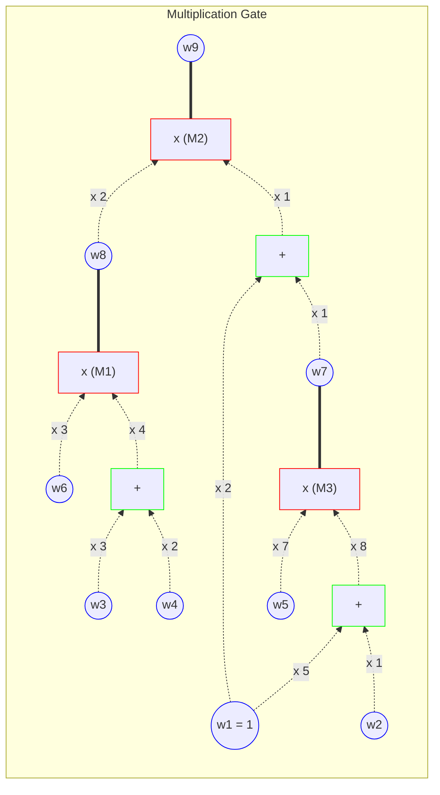
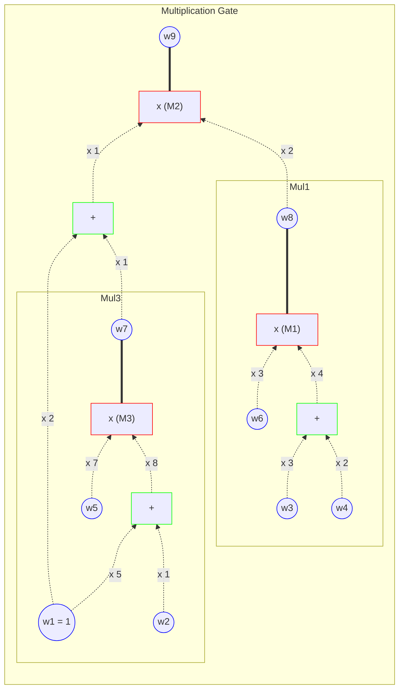
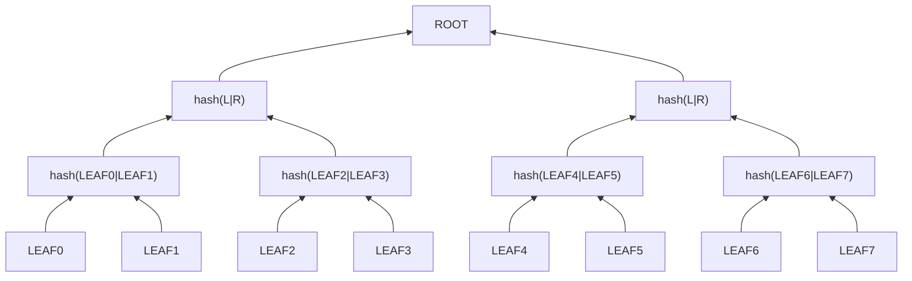
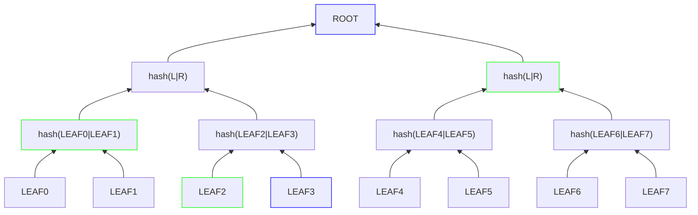
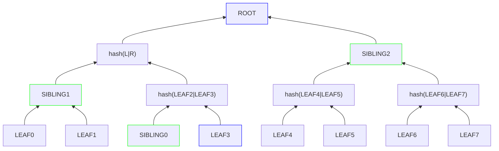

---
defaultTemplate:
  - "[[cs496-2023-fall]]"
---
### KAIST CS496(2023 fall)<br> ZKP - Theory and Applications
Wanseob Lim<br>
PSE, EF

---

#### Lecture 5

Glimpsing into the ZK Applications &
Crafting Circuits using Circom

---

::: title
QAP w/ R1CS
:::

::: left-7

Create matrices for left, right, and output polynomials

- $L_{\mathbf{w}}(X) =  \langle \mathbf{L}(X), \mathbf{w} \rangle$
- $R_{\mathbf{w}}(X) = \langle \mathbf{R}(X), \mathbf{w} \rangle$
- $O_{\mathbf{w}}(X) = \langle \mathbf{O}(X), \mathbf{w} \rangle$

***

Constraints turns into an algebraic formula:

$\begin{align} & \forall X \in \mathbb{H}_{M}, \\ & p_{\mathbf{w}}(X) = L_{\mathbf{w}}(X) \cdot R_{\mathbf{w}}(X) - O_{\mathbf{w}}(X) = 0\end{align}$
***

$\iff \exists Q_{\mathbf{w}}(X) \quad s.t. \quad p_{\mathbf{w}}(X) = A_{\mathbf{}}(X)Q_{\mathbf{w}}(X)$
- where $A(X)=\underset{\forall x \in \mathbb{H}_{M}}{\prod}(X-x)$ 
- Then the verifier checks at a random point such that $p_{\mathbf{w}}(r) = A(r)Q_{\mathbf{w}}(r) = L_{\mathbf{w}}(r) \cdot R_{\mathbf{w}}(r)-O_{\mathbf{w}}(r)$
::: <!-- element style="font-size:0.60em" -->

::: right-3

:::

--

https://zkrepl.dev

--

::: title
from R1CS to Source Code
:::


--

::: title
from R1CS to Source Code
:::

::: left-7
```
pragma circom 2.1.6;


template Example () {

	// signal input w1;  // don't need to declare the constant 1
	signal input w2; //input witness
	signal input w3;
	signal input w4;
	signal input w5;
	signal input w6;
	
	signal w7; // intermediate witness
	signal w8; // intermediate witness
	
	signal output w9; // output is public
	
	// mult gate 1
	w8 <== (3*w6) * 4*(3*w3 + 2*w4);
	// mult gate 3
	w7 <== 8*(w2 + 5) * (7*w5);
	// mult gate 2
	w9 <== (2*w8) * 1*(w7+2);
}

component main { public [ w2 ] } = Example();
```
<!-- element style="font-size:0.3em; width: 25vw"-->
:::

::: right-3

:::

--

::: title
Input wire & Constraints
:::

::: left-7
```
pragma circom 2.1.6;


template Example () {

	// signal input w1;  // don't need to declare the constant 1
	signal input w2; //input witness
	signal input w3;
	signal input w4;
	signal input w5;
	signal input w6;
	
	signal w7; // intermediate witness
	signal w8; // intermediate witness
	
	signal output w9; // output is public
	
	// mult gate 1
	signal mul1left <-- 3*w6; // <-- means input wire
	signal mul1right <-- 4*(3*w3 + 2*w4); // <-- means input wire
	w8 <== mul1left*mul1right;  // <== means contraint
	
	// mult gate 3
	signal mul3left <-- 8*(w2 + 5);
	signal mul3right <-- 7*w5;
	w7 <== mul3left*mul2right;

	// mult gate 2
	signal mul2left <-- 2*w8;
	signal mul2right <-- w7 + 2;
	w9 <== mul2left * mul2right;
}

component main { public [ w2 ] } = Example();
```
<!-- element style="font-size:0.23em; width: 25vw"-->
:::

::: right-3

:::

--

::: title
Component
:::

::: left-3
```
pragma circom 2.1.6;

template Mul1 () {
	signal input in1;
	signal input in2;
	signal input in3;
	signal output out;
	out <== (3*in1) * 4*(3*in2 + 2*in3);
}

template Mul3 () {
	signal input in1;
	signal input in2;
	signal output out;
	out <== 8*(in1 + 5) * 7*(in2);
}

template Example () {

	.
	.
	.


}

component main { public [ w2 ] } = Example();
```
<!-- element style="font-size:0.23em; width: 25vw"-->
:::
::: right-7
```
.
.
.

template Example () {

	// signal input w1;
	signal input w2; //input witness
	signal input w3;
	signal input w4;
	signal input w5;
	signal input w6;
	
	signal output w9; // output is public
	
	// mult gate 1
	component mul1 = Mul1();
	mul1.in1 <-- w6;
	mul1.in2 <-- w3;
	mul1.in3 <-- w4;
	
	// mult gate 3
	component mul3 = Mul3();
	mul3.in1 <-- w2;
	mul3.in2 <-- w5;

	// mult gate 2
	signal mul2left <-- 2*w8;
	signal mul2right <-- w7 + 2;
	w9 <== 2 * mul1.out * (mul3.out + 2);
}
.
.
.

```
<!-- element style="font-size:0.23em; width: 25vw"-->
:::

::: right-3

:::


---

::: title
Zero Knowledge Applicatioins
:::

$$C(x, w) \in \mathcal{R}$$

```
function prove(circuit, public, witness) -> Proof;

function verify(circuit, public, proof) -> boolean;
```

--

::: title
Merkle Tree
:::


<!-- element style="width: 50vw" -->


--

::: title
Merkle Proof
:::


<!-- element style="width: 50vw" -->

--

::: title
Zero Knowledge Membership Proof
:::
::: right-3

:::
::: left
```
template PathFinder {
	signal input path;
	signal input level;
	signal input sibling;
	signal input node;
	
	signal output left;
	signal output right;
	.
	.
	.
}

template Hash() {
	signal input left;
	signal input right;
	
	signal output out;
	.
	.
	.
}

template MerkleProof () {
	.
	.
	.


```
<!-- element style="font-size:0.20em; width: 15vw"-->
:::
::: right-7
```c++

template MerkleProof () {
	signal input path;
	signal input leaf;
	signal input sibling0;
	signal input sibling1;
	signal input sibling2;
	signal output root;
	
	component pf1 = PathFinder();
	component node1 = Hash();
	pf1.path <-- path;
	pf1.level <-- 1;
	pf1.sibling <-- sibling0;
	pf1.node <-- leaf;
	node1.left <-- pf1.left;
	node1.right <-- pf1.right;

	component pf2 = PathFinder();
	component node2 = Hash();
	pf2.path <-- path;
	pf1.level <-- 2;
	pf2.sibling <-- sibling1;
	pf2.node <-- node1.out;
	node2.left <-- pf2.left;
	node2.right <-- pf2.right;
	
	component pf3 = PathFinder();
	component node3 = Hash();
	pf3.path <-- path;
	pf1.level <-- 3;
	pf3.sibling <-- sibling2;
	pf3.node <-- node2.out;
	node3.left <-- pf3.left;
	node3.right <-- pf3.right;
	
	root <== node3.out;
}

component main { public [ root ] } = MerkleProof();
```
<!-- element style="font-size:0.2em; width: 14vw"-->
:::

---

::: title
Possible Applications
:::

::: left
public($x$): ethereum tx hashes

private($w$):
- pre image of tx hashes
- signatures for those tx

relation($\mathcal{R}$): 
- `recover(tx.signature) == tx.signer`<!-- element style="font-size:0.7em"-->
:::

--

::: title
Possible Applications
:::

::: left
public($x$):
- state0
- state1
- state transition params

private($w$):
- intermediate state

relation($\mathcal{R}$): 
- `stf(input, state0) == state1`<!-- element style="font-size:0.7em"-->
:::

--

::: title
Possible Applications
:::

::: left
public($x$):
- state0
- stateN
- N state transition params

private($w$):
- N zkps

relation($\mathcal{R}$): 
- `verify(input, state(i-1), state(i), pi)`<!-- element style="font-size:0.7em"-->
:::

--

::: title
Possible Applications
:::

::: left
public($x$):
- Membership Group
- Poll ID

private($w$):
- Your Identity
- Your signature
- Choice

relation($\mathcal{R}$): 
- `membership.includes(yourIdentity)`
:::<!-- element style="font-size:0.7em"-->

---

::: left
Libraries:

- https://github.com/iden3/circomlib

Language Syntax:
- https://docs.circom.io/circom-language/signals/
:::

---

::: title
Mid-term Assignment
:::

1. Write a circuit that you know $a, b, c$ such that $a^{b} = c$ without revealing $b$.
2. (option) Express the circuit in an R1CS graph


---

Q&A

