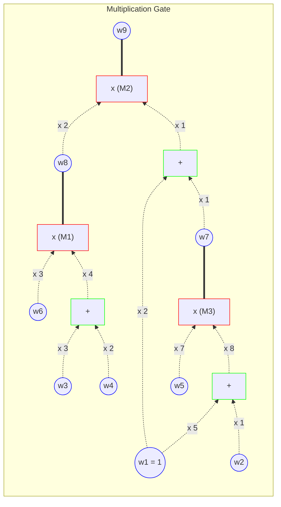
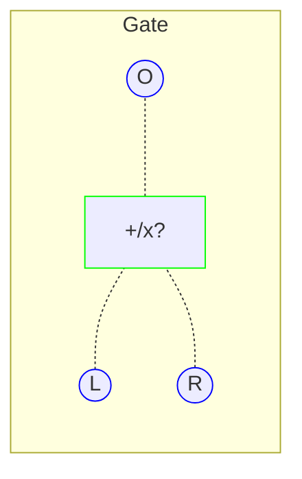
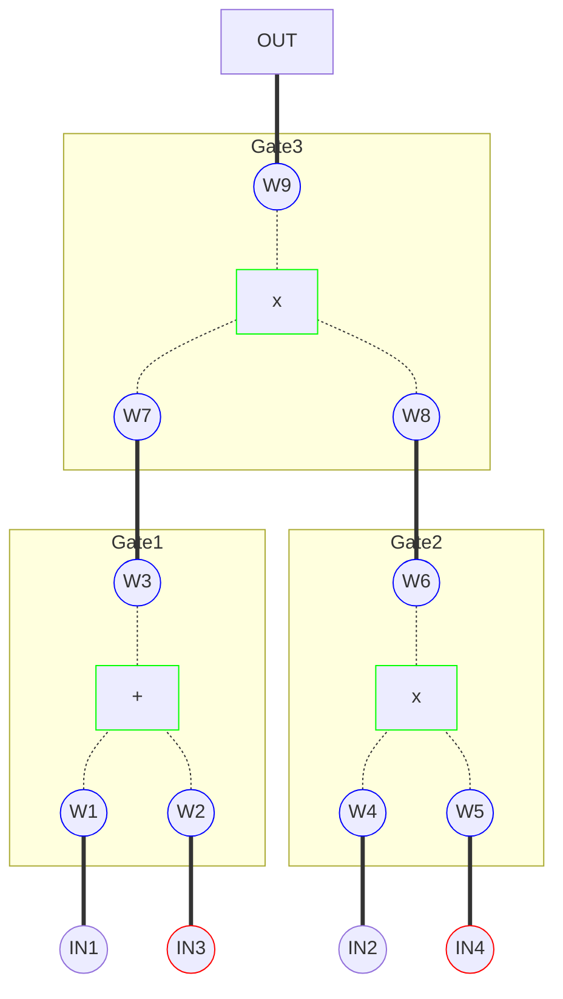

---
defaultTemplate:
  - "[[cs496-2023-fall]]"
---
### KAIST CS496(2023 fall)  ZKP - Theory and Applications
Wanseob Lim 
PSE, EF

---

#### Lecture 6

Various Univariate IOPs & PLONK

---

Polynomial IOPs to query
1. Polynomial Identities
2. Binding Range
3. Grand Sum
4. Grand Product
5. Permutation

---

### Querying **Polynomial Identity**

--

::: title
Testing polynomial identities w/ Public-coin Protocol
:::

$$F(X) \overset{?}{\equiv} G(X)$$
--

::: title
Testing polynomial identities w/ Public-coin Protocol
:::

::: left
$$F(X) \overset{?}{\equiv} G(X)$$

***
#### If for some $r  \overset{\$}{\leftarrow} \mathbb{F}$
$F(r)=G(r)$ and $F,G \in \mathbb{F}^{(\le d)}[X]$
#### Then
$$\mathrm{Pr}\left[\begin{align}& \forall X \in \mathbb{F} \\ & F(X)=G(X) \quad \text{i.e.} \quad F(X) - G(X) = 0\end{align}\right] = 1 - \frac{d}{|\mathbb{F}|}$$
:::<!-- element style="font-size:0.7em"-->

--
::: title
Testing polynomial identities w/ Public-coin Protocol
:::

::: left
$$A(X)B(X)C(X) + D(X) = E(X)F(X)+G(X)$$
:::

--
::: title
Testing polynomial identities w/ Public-coin Protocol
:::

::: left
$$A(X)B(X)C(X) + D(X) = E(X)F(X)+G(X)$$
***
#### If for some $r  \overset{\$}{\leftarrow} \mathbb{F}$
$A(r)B(r)C(r) + D(r) = E(r)F(r) + G(r)$ 

#### Then
$$\mathrm{Pr}\left[\begin{align}& \forall X \in \mathbb{F} \\ & A(X)B(X)C(X) + D(X) = E(X)F(X)+G(X)\end{align}\right] = 1 - \frac{deg}{|\mathbb{F}|}$$

:::<!-- element style="font-size:0.7em"-->

--

::: title
Binding Range
:::

If $F \equiv G$, then for all $X \in \mathbb{F}$, $F(X) = G(X)$
***
How about, checking the fact only for $X \in S \subset \mathbb{F}$?

--

::: title
Binding Range w/ Vanishing Polynomial
:::

::: left
$$F(X) = Z(X)Q(X)$$ 
***
#### If
1. **$Z$ vanishes on a subgroup $S \subset \mathbb{F}$**
	- i.e. **$\forall X \in S, \quad Z(X) = 0$**
	 - ex)  $Z_{S}(X)=(X-a)(X-b)(X-c)$ for $S=\{ a, b,c \}$
3. For some $r  \overset{\$}{\leftarrow} \mathbb{F}$ 
	**$$F(r) = Z(r)Q(r)$$**
***
#### Then
$$\mathrm{Pr}\left[\begin{align}& \forall X \in S, \\ & F(X) = 0\end{align}\right] = 1 - \frac{deg}{|\mathbb{F}|}$$

:::<!-- element style="font-size:0.7em"-->

--

::: title
Opening of a value
:::

How to open $F(x) = y$?

--

::: title
Opening of a value
:::

::: left
$$F(X) = (X-x)Q_{x}(X) + y$$
***
#### If
1. **$X = x, \quad (X- x)Q_{x}(X) = 0$**
1. **$F(r)- y = (X-r)Q_{x}(r)$** for some $r  \overset{\$}{\leftarrow} \mathbb{F}$ 
***
#### Then
$$\mathrm{Pr}\left[\begin{align}&  F(x) = y\end{align}\right] = 1 - \frac{deg}{|\mathbb{F}|}$$

:::<!-- element style="font-size:0.7em"-->

--

::: title
Opening multiple points?
:::

::: left

How to open multiple points?

$F(x_{1}) = y_{1}, F(x_{2})=y_{2},\dots$

:::

--

::: title
Opening using the vanishing polynomials
:::

::: left
$$F(X) = Z(X)Q(X) + R(X)$$
***
#### If
1. **$\forall X \in S, \quad Z(X) = 0$**
1. **$F(r)- R(r) = Z(r)Q(r)$** for some $r  \overset{\$}{\leftarrow} \mathbb{F}$ 
***
#### Then
$$\mathrm{Pr}\left[\begin{align}& \forall X \in S, \\ & F(X) = R(X)\end{align}\right] = 1 - \frac{deg}{|\mathbb{F}|}$$

So we can **open $\left(deg(R) + 1\right)$ points at once.**
:::<!-- element style="font-size:0.7em"-->
--

::: title
Batch Evaluation
:::

What about

**evaluating multiple polynomial identities** at once?

--

::: title
Batch Evaluation using Random Linear Combination
:::

::: left-5
For some $s_{1}, \dots, s_{n} \overset{\$}{\leftarrow} \mathbb{F}$
***
$$\begin{align}& s_{1} ~\cdot ( & F_{1}(X) & = G_{1}(X) \quad )\\ + & s_{2} ~\cdot ( & F_{2}(X) & = G_{2}(X) \quad ) \\ + & s_{3} ~\cdot ( & F_{3}(X) & = G_{3}(X) \quad ) \\ & & \vdots \\ + & s_{n} ~\cdot ( & F_{n}(X) & = G_{n}(X) \quad ) \\ \\ \hline \\ & &  \sum_{i\in [n]} s_{i} \cdot F_{i}(X)  & = \sum_{i\in [n]} s_{i} \cdot G_{i}(X)\end{align}$$
:::<!-- element style="font-size:0.5em"-->
::: right-5
#### If
$\sum_{i\in [n]} s_{i} \cdot F_{i}(r)  = \sum_{i\in [n]} s_{i} \cdot G(r)$ 

for some $r  \overset{\$}{\leftarrow} \mathbb{F}$ 
***
#### Then
$$\mathrm{Pr}\left[\begin{align}& \forall X \in \mathbb{F} ~\text{and}~ \forall i\in[n] \\ & F_{i}(X) = G_{i}(X)\end{align}\right] = 1 - \frac{deg}{|\mathbb{F}|}$$
:::<!-- element style="font-size:0.7em"-->

--

::: title
Batch Evaluation using Random Linear Combination with powers of $\gamma$
:::

::: left-5
For some $\gamma \overset{\$}{\leftarrow} \mathbb{F}$
***
$$\begin{align}& \gamma^{0} ~\cdot ( & F_{1}(X) & = G_{1}(X) \quad )\\ + & \gamma^{1} ~\cdot ( & F_{2}(X) & = G_{2}(X) \quad ) \\ + & \gamma^{2} ~\cdot ( & F_{3}(X) & = G_{3}(X) \quad ) \\ & & \vdots \\ + & \gamma^{n-1} ~\cdot ( & F_{n}(X) & = G_{n}(X) \quad ) \\ \\ \hline \\ & &  \sum_{i\in [n]} \gamma^{i-1} \cdot F_{i}(X)  & = \sum_{i\in [n]} \gamma^{i-1} \cdot G_{i}(X)\end{align}$$
:::<!-- element style="font-size:0.5em"-->
::: right-5
#### If
$\sum_{i\in [n]} \gamma^{i-1} \cdot F_{i}(r)  = \sum_{i\in [n]} \gamma^{i-1} \cdot G(r)$ 

for some $r  \overset{\$}{\leftarrow} \mathbb{F}$ 
***
#### Then
$$\mathrm{Pr}\left[\begin{align}& \forall X \in \mathbb{F} ~\text{and}~ \forall i\in[n] \\ & F_{i}(X) = G_{i}(X)\end{align}\right] = 1 - \frac{n \cdot deg}{|\mathbb{F}|}$$
:::<!-- element style="font-size:0.7em"-->

--

::: title
Batch Evaluations in a Range
:::

::: left-5
For some $s_{1}, \dots, s_{n} \overset{\$}{\leftarrow} \mathbb{F}$
***
$$\begin{align}& s_{1} ~\cdot ( \quad F_{1}(X) \quad = \quad Z_{1}(X)Q_{1}(X) + R_{1}(X) \quad )\\ + & s_{2} ~\cdot ( \quad F_{2}(X) \quad = \quad Z_{2}(X)Q_{2}(X) + R_{2}(X) \quad ) \\ + & s_{3} ~\cdot ( \quad F_{3}(X) \quad = \quad Z_{3}(X)Q_{3}(X) + R_{3}(X) \quad ) \\ & \vdots \\ + & s_{n} ~\cdot ( \quad F_{n}(X) \quad = \quad Z_{n}(X)Q_{n}(X) + R_{n}(X) \quad ) \\ \\ \hline \\ & \sum_{i\in [n]} s_{i} \cdot F_{i}(X)  \quad = \sum_{i\in [n]} s_{i} \cdot (~Z_{i}(X)Q_{i}(X) + R_{i}(X)~)\end{align}$$

where $\quad \forall X \in S_{i},  Z_{i}(X) = 0$

:::<!-- element style="font-size:0.45em"-->

::: right-5
#### If
$\sum_{i\in [n]} s_{i} \cdot F_{i}(r)  = \sum_{i\in [n]} s_{i} \cdot (Z_{i}(r)Q_{i}(r) + R_{i}(r))$ 

for some $r  \overset{\$}{\leftarrow} \mathbb{F}$ 
***
#### Then
$$\mathrm{Pr}\left[\begin{align}& \forall X \in S ~\text{and}~ \forall i\in[n] \\ & F_{i}(X) = R_{i}(X)\end{align}\right] = 1 - \frac{deg}{|\mathbb{F}|}$$
:::<!-- element style="font-size:0.5em"-->

--

::: title
Batch Evaluations in a Range using powers of $\gamma$
:::

::: left-5
For some $\gamma \overset{\$}{\leftarrow} \mathbb{F}$
***
$$\begin{align}& \gamma^{0} ~\cdot ( \quad F_{1}(X) \quad = \quad Z_{1}(X)Q_{1}(X) + R_{1}(X) \quad )\\ + & \gamma^{1} ~\cdot ( \quad F_{2}(X) \quad = \quad Z_{2}(X)Q_{2}(X) + R_{2}(X) \quad ) \\ + & \gamma^{2} ~\cdot ( \quad F_{3}(X) \quad = \quad Z_{3}(X)Q_{3}(X) + R_{3}(X) \quad ) \\ & \vdots \\ + & \gamma^{n-1} ~\cdot ( \quad F_{n}(X) \quad = \quad Z_{n}(X)Q_{n}(X) + R_{n}(X) \quad ) \\ \\ \hline \\ & \sum_{i\in [n]} \gamma^{i-1} \cdot F_{i}(X)  \quad = \sum_{i\in [n]} \gamma^{i-1} \cdot (~Z_{i}(X)Q_{i}(X) + R_{i}(X)~)\end{align}$$

where $\quad \forall X \in S_{i},  Z_{i}(X) = 0$

:::<!-- element style="font-size:0.45em"-->

::: right-4
#### If
$\sum_{i\in [n]} \gamma^{i-1} \cdot F_{i}(r)  = \sum_{i\in [n]} \gamma^{i-1} \cdot (Z_{i}(r)Q_{i}(r) + R_{i}(r))$ 

for some $r  \overset{\$}{\leftarrow} \mathbb{F}$ 
***
#### Then
$$\mathrm{Pr}\left[\begin{align}& \forall X \in S ~\text{and}~ \forall i\in[n] \\ & F_{i}(X) = R_{i}(X)\end{align}\right] = 1 - \frac{\text{max}\{(n-1), deg\}}{|\mathbb{F}|}$$
:::<!-- element style="font-size:0.5em"-->

---

### Querying **Grand Sum**

--

::: title
Grand Sum 
:::

$$\mathbb{H} = \{ 1, \omega, \omega^{2}, \dots, \omega^{d-1} \}$$

Return 

$$\sum_{\forall X \in \mathbb{H}} f(X)$$

and its proof $\pi$

--

::: title
Univariate Sumcheck
:::

::: left-5

$$\begin{align}f(X) & = Z(X)Q(X) + R(X) \\ & = f_{0} + f_{1}X + f_{2}X^{2} + \cdots + f_{d-1}X^{d-1}\end{align}$$
***

where

$$\begin{align}R(X) & = \sum_{i\in[d]}y_{i} L_{i}(X) \\ &  = a_{0} + a_{1}X + a_{2}X^{2} + \cdots + a_{d-1}X^{d-1}\end{align}$$

$$\begin{align}\begin{cases} L_{i}(\omega^{j}) & = 1 ~ for ~ j = i - 1\\ L_{i}(\omega^{j}) & = 0 ~ for ~ j \neq i - 1\end{cases}\end{align} \quad \text{and} \quad \omega^{d} = 1$$
::: <!-- element style="font-size: 0.5em" -->
::: right-5
#### If  
$\forall X \in \mathbb{H}^{*}=\{1, \omega, \omega^{2},\dots,\omega^{d-1}\}$

$Z(X) = 0$
***
#### Then,

$\forall X \in \mathbb{H}^{*}$

$f(X) = R(X)$

i.e. $$f(\omega^{i-1})=y_{i}$$

::: <!-- element style="font-size: 0.5em" -->

--

::: title
Univariate Sumcheck
:::

::: left
$S = \sum_{X\in \mathbb{H}^{*}}f(X) = \sum_{X\in \mathbb{H}^{*}}R(X) = R(\omega^{0}) + R(\omega^{1})+ \cdots + R(\omega^{d-1})$
***
$$\begin{align}  &  \\ & & R(\omega^{0}) & = & a_{0} {(\omega^{0})}^{0} + a_{1} {(\omega^{0})}^{1} + a_{2}{(\omega^{0})}^{2} + a_{3}{(\omega^{0})}^{3} + \cdots + a_{d-1}{(\omega^{0})}^{d-1} \\ & + & R(\omega^{1}) & = & a_{0}{(\omega^{1})}^{0} + a_{1} {(\omega^{1})}^{1} + a_{2}{(\omega^{1})}^{2} + a_{3}{(\omega^{1})}^{3} + \cdots + a_{d-1}{(\omega^{1})}^{d-1} \\ & + & R(\omega^{2}) & = & a_{0}{(\omega^{2})}^{0} + a_{1} {(\omega^{2})}^{1} + a_{2}{(\omega^{2})}^{2} + a_{3}{(\omega^{2})}^{3} + \cdots + a_{d-1}{(\omega^{2})}^{d-1} \\ & & \vdots \\ & + & R(\omega^{d-1}) & = & a_{0}{(\omega^{d-1})}^{0} + a_{1} {(\omega^{d-1})}^{1} + a_{2}{(\omega^{d-1})}^{2} + \quad \cdots + a_{d-1}{(\omega^{d-1})}^{d-1}\end{align}$$

::: <!-- element style="font-size: 0.7em"-->

--

::: title
Univariate Sumcheck
:::
::: left
$$\begin{align}S & = & & a_{0}({(\omega^{0})}^{0} + {(\omega^{1})}^{0} + \cdots + {(\omega^{d-1})}^{0}) & = \quad & a_{0}({(\omega^{0})}^{0} + {(\omega^{0})}^{1} + {(\omega^{0})}^{2} \cdots + {(\omega^{0})}^{d-1}) & = \quad & a_{0}\left( \sum_{i=0}^{d-1} 1^{i} \right) \\ &  &  + & a_{1}({(\omega^{0})}^{1} + {(\omega^{1})}^{1} + \cdots + {(\omega^{d-1})}^{1}) & + & a_{1}({(\omega^{1})}^{0} + {(\omega^{1})}^{1} + {(\omega^{1})}^{2} + \cdots + {(\omega^{1})}^{d-1}) & + & a_{1} \cdot 0 \\&  & + & a_{2}({(\omega^{0})}^{2} + {(\omega^{1})}^{2} + \cdots + {(\omega^{d-1})}^{2}) & + & a_{2}({(\omega^{2})}^{0} + {(\omega^{2})}^{1} + {(\omega^{2})}^{2} + \cdots + {(\omega^{2})}^{d-1}) & + & a_{2} \cdot 0 \\&  &  &  \vdots & & \vdots && \vdots \\&  &  + & a_{d-1}({(\omega^{0})}^{d-1} + {(\omega^{1})}^{d-1} + \cdots + {(\omega^{d-1})}^{d-1}) & + & a_{d-1}({(\omega^{d-1})}^{0} + {(\omega^{d-1})}^{1} + {(\omega^{d-1})}^{2} + \cdots + {(\omega^{d-1})}^{d-1}) & + & a_{d-1} \cdot 0\end{align}$$
***
$$S = d \cdot a_{0} = d R(0)$$
::: <!-- element style="font-size: 0.4em"-->

--

::: title
Univariate Sumcheck
:::

::: left
Therefore, to evaluate the sum $S = \sum_{\forall x \in \mathbb{H}} f(X)$ we can do that with a public coin protocol by choosing a random $r \overset{\text{public coin}}{\leftarrow} \mathbb{F}_{p}$ then we can evaluate them as

$$
f(r) = Z_{\mathbb{H}}(r)Q(r) + R(r)
$$
And 
$$
S = dR(0)
$$

We can use KZG or Inner Product Argument or etc.
::: <!-- element style="font-size: 0.5em" -->

---
### Querying **Grand Product**

--

::: title
Univariate ProdCheck on $\mathbb{H}^{*}$
:::

::: left

$\prod\limits_{\forall X \in \mathbb{H}}f(X) \overset{?}{=} 1$

$\prod\limits_{\forall X \in \mathbb{H}}f(X) \overset{?}{=} \prod\limits_{\forall X \in \mathbb{H}}g(X)$

:::

--

::: title
Univariate ProdCheck on $\mathbb{H}^{*}$
:::

$$f\in \mathbb{F}[X]$$

$$\mathbb{H}=\{ 1, \omega, \omega^{2}, \dots, \omega^{k-1}\}$$
where $\omega^{k}=1$

***

$\prod\limits_{\forall X \in \mathbb{H}}f(X) \overset{?}{=} 1$

--

::: title
Univariate ProdCheck on $\mathbb{H}^{*}$
:::

::: left-4
Let $t \in \mathbb{F}_{p}^{(\le k)}[X]$ 

and

$$\begin{align}& \forall i \in [0, k-1] \\ & t(\omega^{i}) = \overset{i}{\underset{j=0}\prod} f(\omega^{j}) \\ \end{align} $$
::: <!-- element style="font-size:0.6em" -->

::: right-7
Then it'll look like

$$\begin{align} & t(1) & = & \quad f(1) \\ & t(\omega) & = & \quad f(1)f(\omega) \\ & t(\omega^{2}) & = & \quad f(1)f(\omega)f(\omega^{2}) \\ & & \vdots \\ & t(\omega^{k-1}) & = & \quad f(1)f(\omega)f(\omega^{2})\cdots f(\omega^{k - 1}) = \underset{\forall X \in  \mathbb{H}^{*}}{\prod} f(X)\\ \end{align} $$
::: <!-- element style="font-size:0.6em" -->

--

::: title
Univariate ProdCheck on $\mathbb{H}^{*}$
:::

::: left-4

$\forall i\in[0,k], \quad \frac{t(\omega^{i})}{t(\omega^{i - 1})} = f(\omega^{i})$

$\iff \forall X \in \mathbb{H}, \quad  t(\omega X) = t(X)f(\omega X)$

$\because \quad \forall i \in [0, k-1],  \quad t(\omega^{i}) = \overset{i}{\underset{j=0}\prod} f(\omega^{j})$

::: <!-- element style="font-size: 0.5em" -->

::: right-5

$$\begin{align} \therefore \quad & \underset{\forall X \in  \mathbb{H}^{*}}{\prod} f(X) = 1 \\ \iff & \exists ~ t \in \mathbb{F}_{p}^{(\le k)}[X] \\ & s.t \quad t(\omega^{k-1}) = 1  \\ & \text{and}  \\ & \forall x \in \mathbb{H}^{*} \\ & t(\omega X) -t(X)f(\omega X) = 0 \end{align} $$

::: <!-- element style="font-size: 0.5em" -->

--

::: title
Evaluation
:::

::: left-4
$$ \begin{align} & \exists ~ Q \in \mathbb{F}_{p}^{(\le d)}[X] \\ \\ & s.t. \\ \\ & t(\omega X) -t(X)f(\omega X) = Z(X)Q(X) \\ \\  & \text{and} \\ \\ &  \forall X \in \mathbb{H}, Z(X) = 0 \quad \text{i.e.}~Z(X) = X^{k} - 1 \end{align} $$

::: <!-- element style="font-size: 0.55em" -->

::: right-5
#### If
$t(\omega r) - t(r)f(\omega r) = (r^{k} - 1) Q(r)$  for some $r  \overset{\$}{\leftarrow} \mathbb{F}$ 

and  $t(\omega^{k-1}) = 1$
***
#### Then
$$\mathrm{Pr}\left[\underset{\forall X \in  \mathbb{H}^{*}}{\prod} f(X) = 1\right] = 1 - \frac{deg}{|\mathbb{F}|}$$
::: <!-- element style="font-size: 0.55em" -->

--

::: title
GrandProd Eqauility on $\mathbb{H}^{*}$
:::

$$f, g\in \mathbb{F}[X]$$

$$\mathbb{H}=\{ 1, \omega, \omega^{2}, \dots, \omega^{k-1}\}$$
where $\omega^{k}=1$

***

$\prod\limits_{\forall X \in \mathbb{H}}f(X) \overset{?}{=} \prod\limits_{\forall X \in \mathbb{H}}g(X)$

$\iff \prod\limits_{\forall X \in \mathbb{H}} \frac{f(X)}{g(X)}  \overset{?}{=} 1$

--

::: title
GrandProd Eqauility on $\mathbb{H}^{*}$
:::

::: left-4
Let $t \in \mathbb{F}_{p}^{(\le k)}[X]$ 

and $\forall i \in [0, k-1]$,  $t(\omega^{i}) = \overset{i}{\underset{j=0}\prod} \frac{f(\omega^{j})}{g(\omega^{j})}$

***

$\forall i\in[0,k], \quad \frac{t(\omega^{i})}{t(\omega^{i - 1})} = \frac{f(\omega^{i})}{g(\omega^{i})}$

$\iff \forall X \in \mathbb{H}, \quad  t(\omega X)g(\omega X) = t(X)f(\omega X)$

$\because \quad \forall i \in [0, k-1],  \quad t(\omega^{i}) = \overset{i}{\underset{j=0}\prod} \frac{f(\omega^{j})}{g(\omega^{j})}$

::: <!-- element style="font-size: 0.5em" -->

::: right-5

$$\begin{align} \therefore \quad & \underset{\forall X \in  \mathbb{H}^{*}}{\prod} \frac{f(X)}{g(X)} = 1 \\ \iff & \exists ~ t \in \mathbb{F}_{p}^{(\le k)}[X] \\ & s.t \quad t(\omega^{k-1}) = 1  \\ & \text{and}  \\ & \forall x \in \mathbb{H}^{*} \\ & t(\omega X)g(\omega X) -t(X)f(\omega X) = 0 \end{align} $$

::: <!-- element style="font-size: 0.5em" -->

--

::: title
Evaluation 
:::

::: left-4
$$ \begin{align} & \exists ~ Q \in \mathbb{F}_{p}^{(\le d)}[X] \\ \\ & s.t. \\ \\ & t(\omega X)g(\omega X) -t(X)f(\omega X) = Z(X)Q(X) \\ \\  & \text{and} \\ \\ &  \forall X \in \mathbb{H}, Z(X) = 0 \quad \text{i.e.}~Z(X) = X^{k} - 1 \end{align} $$

::: <!-- element style="font-size: 0.55em" -->

::: right-5
#### If
$t(\omega r)g(\omega r) - t(r)f(\omega r) = (r^{k} - 1) Q(r)$  for some $r  \overset{\$}{\leftarrow} \mathbb{F}$ 

and  $t(\omega^{k-1}) = 1$
***
#### Then
$$\mathrm{Pr}\left[\underset{\forall X \in  \mathbb{H}^{*}}{\prod} f(X) = \underset{\forall X \in  \mathbb{H}^{*}}{\prod} g(X)\right] = 1 - \frac{(k+1) \cdot deg}{|\mathbb{F}|}$$
::: <!-- element style="font-size: 0.55em" -->

---

### Querying **Permutation**

--

::: title
Checking Permutation
:::

::: left
How to prove that $\vec{a}$ and  $\vec{b}$ is a permutation of each other?

$\vec{a}=( a_{1}, a_{2}, \dots, a_{n})$

$\vec{b}=( b_{1}, b_{2}, \dots, b_{n})$
:::

--

::: title
Permutation of vectors
:::

::: left
$\vec{a}=( a_{1}, a_{2}, \dots, a_{n})$

$\vec{b}=( b_{1}, b_{2}, \dots, b_{n})$

***

If $\vec{a}$ is a permutation of $\vec{b}$,

$\underset{i\in[n]}{\prod} (a_{i} + r) = \underset{i\in[n]}{\prod} (b_{i} + r)$  for a random $r \overset{\$}{\leftarrow}\mathbb{F}$

:::

--

::: title
Permutation of vectors
:::

::: left
$\vec{a}=( a_{1}, a_{2}, \dots, a_{n})$

$\vec{b}=( b_{1}, b_{2}, \dots, b_{n})$

***
We can define $f, g \in \mathbb{F}^{(\le n-1)}[X]$

$\begin{align} \forall i \in [n], & r \overset{\$}{\leftarrow}\mathbb{F}  \\  f_{r}(\omega^{i-1}) = a_{i} + r \\ g_{r}(\omega^{i-1}) = b_{i} + r\end{align}$ 

:::

--

::: title
Permutation of vectors
:::

::: left
$\underset{i\in[n]}{\prod} (r + a_{i}) = \underset{i\in[n]}{\prod} (r + b_{i}) \iff \underset{X\in\mathbb{H}^{*}}{\prod} \frac{f(X)}{g(X)} = 1$  
for a random $r \overset{\$}{\leftarrow}\mathbb{F}$

***
where   
$\begin{align} \forall i \in [n], r \overset{\$}{\leftarrow}\mathbb{F}  \\  f_{r}(\omega^{i-1}) = a_{i} + r \\ g_{r}(\omega^{i-1}) = b_{i} + r\end{align}$ 

::: <!--element style="font-size:0.8em" -->

--

::: title
Permutation of vectors with bound indices
:::

::: left
$\vec{a}=( a_{1}, a_{2}, \dots, a_{n})$

$\vec{b}=( b_{1}, b_{2}, \dots, b_{n})$

where $\sigma: \mathbb{H}\rightarrow \mathbb{H}$ and $\{ \sigma(X)~|~ \forall X\in \mathbb{H} \} \equiv \mathbb{H}$

***

if $\forall X \in \mathbb{H}, g(X) = f(\sigma(X))$, 

then $g$ is a $\sigma$ permutation of $f$

If $\vec{a}$ is a permutation of $\vec{b}$,

::: <!--element style="font-size:0.8em" -->

--
::: title
Permutation of vectors with bound indices
:::
::: left
$\prod\limits_{\forall X \in \mathbb{H}} (f(X) + r +  s\cdot X) = \prod\limits_{\forall X \in \mathbb{H}} (g(X) + r + s \cdot \sigma(X))$ 

for a random $r \overset{\$}{\leftarrow}\mathbb{F}$

:::<!-- element style="font-size:0.7em" -->

---

::: right-7

**P**ermutations over

**L**agrange-bases for

**O**ecumenical

**N**oninteractive argument of 

**K**nowledge
:::

---
::: title
Recall R1CS & Groth16
:::

::: left-7

Create matrices for left, right, and output polynomials

- $L_{\mathbf{w}}(X) =  \langle \mathbf{L}(X), \mathbf{w} \rangle$
- $R_{\mathbf{w}}(X) = \langle \mathbf{R}(X), \mathbf{w} \rangle$
- $O_{\mathbf{w}}(X) = \langle \mathbf{O}(X), \mathbf{w} \rangle$

***

Constraints turns into an algebraic formula:

$\begin{align} & \forall X \in \mathbb{H}_{M}, \\ & p_{\mathbf{w}}(X) = L_{\mathbf{w}}(X) \cdot R_{\mathbf{w}}(X) - O_{\mathbf{w}}(X) = 0\end{align}$
***

$\iff \exists Q_{\mathbf{w}}(X) \quad s.t. \quad p_{\mathbf{w}}(X) = A_{\mathbf{}}(X)Q_{\mathbf{w}}(X)$
- where $A(X)=\underset{\forall x \in \mathbb{H}_{M}}{\prod}(X-x)$ 
- Then the verifier checks at a random point such that $p_{\mathbf{w}}(r) = A(r)Q_{\mathbf{w}}(r) = L_{\mathbf{w}}(r) \cdot R_{\mathbf{w}}(r)-O_{\mathbf{w}}(r)$
::: <!-- element style="font-size:0.60em" -->

::: right-3

:::

--

::: title
Plonkish Arithemetization
:::

::: left-6
1. Gate node
2. Has 2 fan-in & 1 fan-out
:::
::: right-3

:::

--

::: title
Plonkish Arithemetization
:::

::: left-4

### **Wiring Information**

|$X$  | **$\sigma(X)$**| $T(X)$ |  | $T(\sigma(X))$ |
| --- | --- | --| --- |--- |
| $\omega^{-1}$ | $\omega^{0}$ | IN1   | == | W1  |
| $\omega^{-2}$|  $\omega^{3}$ |IN2    | == | W4  |
| $\omega^{-3}$| $\omega^{1}$ | IN3    | == | W2  |
| $\omega^{-4}$|  $\omega^{4}$ | IN4    | == | W5  |
| $\omega^{0}$| $\omega^{-1}$ | W1 | == | IN1 |
| $\omega^{1}$|  $\omega^{-3}$ |W2 | == | IN3 |
| $\omega^{2}$|  $\omega^{6}$ |W3 | == | W7 |
| $\omega^{3}$| $\omega^{-2}$ | W4 | == | IN2 |
| $\omega^{4}$|  $\omega^{-4}$ |W5 | == | IN4 |
| $\omega^{5}$|  $\omega^{7}$ |W6 | == | W8 |
| $\omega^{6}$|  $\omega^{2}$ |W7 | == | W3 |
| $\omega^{7}$|  $\omega^{5}$ |W8 | == | W6 |
| $\omega^{8}$|  $\omega^{8}$ |W9 | == | 0 |

:::<!-- element style="font-size:0.4em" -->

::: right-6
### **Gate Information**
| #   | Gate | Left | Right | Out |
| --- | ---- | ---- | ----- | --- |
| 1   | +    | W1   | W2    | W3  |
| 2   | x    | W4   | W5    | W6  |
| 3   | x    | W7   | W8    | W9  |
   
 
### Input Information

| Input | Publicity |
| ----- | --------- |
| **IN1**| true      |
| **IN2**   | true      |
| IN3   | false     |
| IN4   | false     |
:::<!-- element style="font-size:0.4em" -->
::: right-3

:::

--

::: title
Plonkish Arithemetization
:::

::: left-4

### Wiring Information

|$X$  | $\sigma(X)$| $T(X)$ |  | $T(\sigma(X))$ |
| --- | --- | --| --- |--- |
| $\omega^{-1}$ | $\omega^{0}$ | **IN1**   | == | W1  |
| $\omega^{-2}$|  $\omega^{3}$ |**IN2**    | == | W4  |
| $\omega^{-3}$| $\omega^{1}$ | IN3    | == | W2  |
| $\omega^{-4}$|  $\omega^{4}$ | IN4    | == | W5  |
| $\omega^{0}$| $\omega^{-1}$ | W1 | == | IN1 |
| $\omega^{1}$|  $\omega^{-3}$ |W2 | == | IN3 |
| $\omega^{2}$|  $\omega^{6}$ |W3 | == | W7 |
| $\omega^{3}$| $\omega^{-2}$ | W4 | == | IN2 |
| $\omega^{4}$|  $\omega^{-4}$ |W5 | == | IN4 |
| $\omega^{5}$|  $\omega^{7}$ |W6 | == | W8 |
| $\omega^{6}$|  $\omega^{2}$ |W7 | == | W3 |
| $\omega^{7}$|  $\omega^{5}$ |W8 | == | W6 |
| $\omega^{8}$|  $\omega^{8}$ |W9 | == | 0 |

:::<!-- element style="font-size:0.4em" -->

::: right-6

## **IOP 1: Input check**
$\forall X \in \{ \omega^{-1}, \dots, \omega^{-2} \}=\mathbb{H}_{\text{input}}$ , 

$$V(\omega^{-i})=\text{INPUT}_{i}$$
and
$$V(\omega^{-i})=T(\omega^{-i})$$

***
Do zero check using public coin protocol

$$T(X) = Z_{\mathbb{H}_{\text{input}}}(X)Q(X) + V(X)$$

***
### Input Information

| Input | Publicity |
| ----- | --------- |
| **IN1**| true      |
| **IN2**   | true      |
| IN3   | false     |
| IN4   | false     |
:::<!-- element style="font-size:0.4em" -->

::: right-3

:::

--

::: title
Plonkish Arithemetization
:::

::: left-4

### Wiring Information

|$X$  | $\sigma(X)$| **$T(X)$** |  | **$T(\sigma(X))$** |
| --- | --- | --| --- |--- |
| $\omega^{-1}$ | $\omega^{0}$ | IN1   | == | W1  |
| $\omega^{-2}$|  $\omega^{3}$ |IN2    | == | W4  |
| $\omega^{-3}$| $\omega^{1}$ | IN3    | == | W2  |
| $\omega^{-4}$|  $\omega^{4}$ | IN4    | == | W5  |
| $\omega^{0}$| $\omega^{-1}$ | W1 | == | IN1 |
| $\omega^{1}$|  $\omega^{-3}$ |W2 | == | IN3 |
| $\omega^{2}$|  $\omega^{6}$ |W3 | == | W7 |
| $\omega^{3}$| $\omega^{-2}$ | W4 | == | IN2 |
| $\omega^{4}$|  $\omega^{-4}$ |W5 | == | IN4 |
| $\omega^{5}$|  $\omega^{7}$ |W6 | == | W8 |
| $\omega^{6}$|  $\omega^{2}$ |W7 | == | W3 |
| $\omega^{7}$|  $\omega^{5}$ |W8 | == | W6 |
| $\omega^{8}$|  $\omega^{8}$ |W9 | == | 0 |

:::<!-- element style="font-size:0.4em" -->

::: right-6

### **IOP 2: Prescribed Permutation**
$\forall X \in \{ 1, \omega, \dots, \omega^{8},\omega^{-4}, \dots, \omega^{-1} \}=\mathbb{H}$ , 

Prove that $T(X) = T(\sigma(X))$

$\prod\limits_{\forall X \in \mathbb{H}} \frac{T(\sigma(X)) + r +  s\cdot X}{T(X) + r + s \cdot \sigma(X)} = 1$ 

for a random $r \overset{\$}{\leftarrow}\mathbb{F}$

:::<!-- element style="font-size:0.4em" -->

::: right-3

:::

--

::: title
Plonkish Arithemetization
:::

::: left-4

### **IOP 3: Gate Check**
$\forall i \in [|\text{Gates}|]$ , 

$$\begin{align}&~S(\omega^{3i})&  \cdot (T(\omega ^{3i}) + T(\omega^{3i+1})) \\ + & ~(1 - S(\omega^{3i})) &\cdot(T(\omega^{3i}\cdot T(\omega^{3i+1}))) \\ =  & &T(\omega^{3i+2})\end{align}$$

$\prod\limits_{\forall X \in \mathbb{H}} \frac{T(\sigma(X)) + r +  s\cdot X}{T(X) + r + s \cdot \sigma(X)} = 1$ 

for a random $r \overset{\$}{\leftarrow}\mathbb{F}$

:::<!-- element style="font-size:0.4em" -->

::: right-6
### **Gate Information**
| #   | Gate | Left | Right | Out | $S(X)$              |
| --- | ---- | ---- | ----- | --- | ------------------- |
| 1   | +    | W1   | W2    | W3  | $S(\omega^{0}) = 1$ |
| 2   | x    | W4   | W5    | W6  | $S(\omega^{3}) = 0$ |
| 3   | x    | W7   | W8    | W9  | $S(\omega^{6}) = 0$ |

Where **$S(X)$** is a public polynomial

:::<!-- element style="font-size:0.4em" -->

::: right-3

:::

--

::: title
Plonkish Arithemetization
:::

::: left-4

### Wiring Information

|$X$  | $\sigma(X)$| $T(X)$ |  | $T(\sigma(X))$ |
| --- | --- | --| --- |--- |
| $\omega^{-1}$ | $\omega^{0}$ | IN1   | == | W1  |
| $\omega^{-2}$|  $\omega^{3}$ |IN2    | == | W4  |
| $\omega^{-3}$| $\omega^{1}$ | IN3    | == | W2  |
| $\omega^{-4}$|  $\omega^{4}$ | IN4    | == | W5  |
| $\omega^{0}$| $\omega^{-1}$ | W1 | == | IN1 |
| $\omega^{1}$|  $\omega^{-3}$ |W2 | == | IN3 |
| $\omega^{2}$|  $\omega^{6}$ |W3 | == | W7 |
| $\omega^{3}$| $\omega^{-2}$ | W4 | == | IN2 |
| $\omega^{4}$|  $\omega^{-4}$ |W5 | == | IN4 |
| $\omega^{5}$|  $\omega^{7}$ |W6 | == | W8 |
| $\omega^{6}$|  $\omega^{2}$ |W7 | == | W3 |
| $\omega^{7}$|  $\omega^{5}$ |W8 | == | W6 |
| **$\omega^{8}$**|  $\omega^{8}$ |W9 | == | **0** |

:::<!-- element style="font-size:0.4em" -->

::: right-6

### **IOP 4: Output check**
Prove that $T(\omega^{8}) = 0$

Prove that
$$T(r) = (r-\omega^{8})Q_{\omega^{8}}(r)$$

for a random $r \overset{\$}{\leftarrow}\mathbb{F}$

:::<!-- element style="font-size:0.4em" -->

::: right-3

:::

---

QnA
