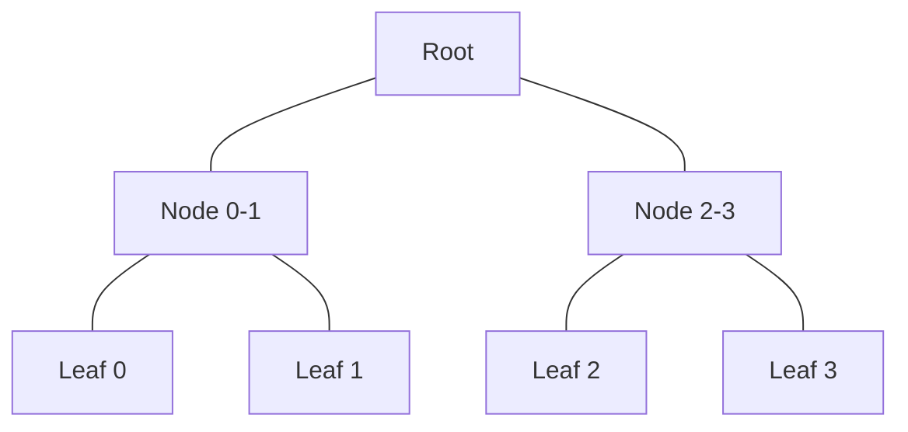

---
defaultTemplate:
  - "[[cs496-2023-fall]]"
---
### KAIST CS496(2023 fall)  ZKP - Theory and Applications
Wanseob Lim 
PSE, EF

---

#### Lecture 9

Proof Recursion & Folding Schemes

---
::: title
Merkle Root Proof of $2^{10}$ items
:::

::: left-5

:::
::: right-5
+ $2^{10} - 1$ hashes
+ ex) 1 hash needs a sub circuit with $2^{10}$ constraints
+ total # of constraints: $\simeq 2^{20}$
:::<!-- element style="font-size:0.8em" -->

---
::: title
Divide circuits & Parallelize them
:::
::: left-3
| $L$ | $R$ | $O$ | $\pi$ |
| --- | --- | --- | ----- |
|  $l_{1}$   |  $r_{1}$   |  $o_{1}$   |   $\pi_{1}$   |
|  $l_{2}$   |  $r_{2}$   |  $o_{2}$   |   $\pi_{2}$   |
|  $l_{3}$   |  $r_{3}$   |  $o_{3}$   |   $\pi_{3}$   |
:::
::: right-7
+ Can we evaluate those proofs inside of circuit?
+ $\pi$ is a set of group elements
:::

---

::: title
Proof Composition
::: 
::: left-5
**Outer** proving system
- $x_{out}, w_{out} \in \mathbb{F}_{p_{out}}$
- $\pi_{out} \in \mathbb{F}_{q_{out}}$

**Inner** proving system
- $x_{in}, w_{in} \in \mathbb{F}_{p_{in}}$
- $\pi_{in} \in \mathbb{F}_{q_{in}}$
:::
::: right-5
Requisite:

$\mathbb{F}_{q_{in}} \subseteq \mathbb{F}_{p_{out}}$
:::<!-- element class="fragment" -->

note:
- what's the best for the inner proof system?
- what's the best for the outer proof system?

---

::: title
Proof Recursion using Cycle
::: 

::: left-5
**Outer** proving system
- $x_{out}, w_{out} \in \mathbb{F}_{p_{out}}$
- $\pi_{out} \in \mathbb{F}_{q_{out}}$

**Inner** proving system
- $x_{in}, w_{in} \in \mathbb{F}_{p_{in}}$
- $\pi_{in} \in \mathbb{F}_{q_{in}}$
:::
::: right-5
Requisite:

$\mathbb{F}_{q_{in}} \subseteq \mathbb{F}_{p_{out}}$

$\mathbb{F}_{q_{out}} \subseteq \mathbb{F}_{p_{in}}$
:::<!-- element class="fragment" -->

note:
- can we use KZG pairing for the outer proof system? no.

---
::: title
Pasta Curve & IPA
:::

::: left
$y^{2} = X^{3} + 5$

Pasta curve gives us the cycle groups as

$| E(\mathbb{F}_{p}) | = q$ 

$|E(\mathbb{F}_{q})|=p$
:::

---

::: title
Batch Witness Assignment 
:::

Recall R1CS

---

::: title
Folding 2 R1CS constraints into 1 constraint
:::
::: left

$$\begin{align} \\ & & L_{1}\cdot R_{1} = O_{1} \\+ & r \cdot & \left( L_{2}\cdot R_{2} = O_{2}\right) \\ \\\hline \\& & (L_{1} + rL_{2})\cdot (R_{1} + rR_{2})\overset{?}{=}O_{1} + rO_{2}\end{align}$$
:::

---
::: title
Folding 2 R1CS constraints into 1 constraint
:::
::: left
$(L_{1} + rL_{2})\cdot(R_{1}+rR_{2}) = L_{1}R_{1} + r(L_{1}R_{2} + R_{1}L_{2}) + r^{2}L_{2}R_{2}$
:::<!-- element style="font-size:0.6em" -->

---

::: title
Relaxed R1CS
:::

::: left
for example, let's try to define the R1CS again as

$L \cdot R = c\cdot O + e$
:::

--

::: title
Relaxed R1CS
:::

::: left
$L_{1}R_{1} = c_{1}O_{1} + e_{1}$

$L_{2}R_{2} = c_{2}O_{2} + e_{2}$
***
$(L_{1}+rL_{2})(R_{1}+rR_{2})=L_{1}R_{1} + r^{2}L_{2}R_{2} + r(L_{1}R_{2}+L_{2}R_{1})$

$=c_{1}O_{1}+e_{1} + r^{2}(c_{2}O_{2}+e_{2}) + r(L_{1}R_{2}+L_{2}R_{1})$

$=(c_{1}+rc_{2})(O_{1} + rO_{2}) +r(L_{1}R_{2} + L_{2}R_{1} - c_{1}O_{2}-c_{2}O_{1})$
$=(c_{1}+rc_{2})(O_{1} + rO_{2}) +e_{1} + r^{2}e_{2} + r(L_{1}R_{2} + L_{2}R_{1} - c_{1}O_{2}-c_{2}O_{1})$
:::<!--element style="font-size:0.7em"-->

---

::: title
Examples:
:::

- ZK-VM
- ZK-ML
- VDF

::: title
Zator: Neural network with Nova
:::

